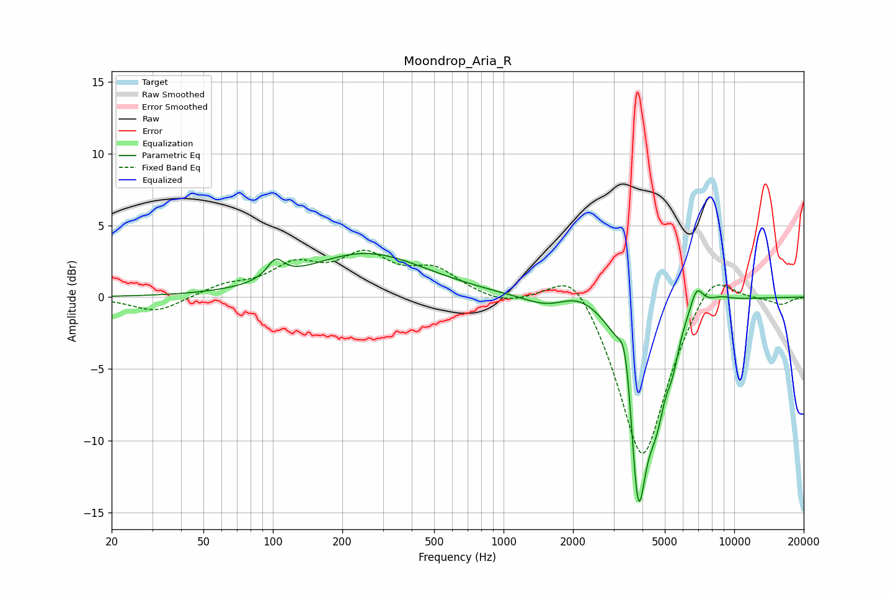

# Moondrop_Aria_R
See [usage instructions](https://github.com/jaakkopasanen/AutoEq#usage) for more options and info.

### Parametric EQs
Apply preamp of -3.1 dB when using parametric equalizer.

|   # | Type    |   Fc (Hz) |    Q |   Gain (dB) |
|-----|---------|-----------|------|-------------|
|   1 | Peaking |       103 | 3.91 |         1.3 |
|   2 | Peaking |       254 | 0.55 |         3   |
|   3 | Peaking |      1574 | 1.35 |        -0.9 |
|   4 | Peaking |      2087 | 1.45 |         1   |
|   5 | Peaking |      3391 | 4.88 |         3.9 |
|   6 | Peaking |      3830 | 3.42 |       -14.2 |
|   7 | Peaking |      4605 | 3.42 |        -4.3 |
|   8 | Peaking |      5403 | 5.01 |        -1.9 |
|   9 | Peaking |      6871 | 4.81 |         1.7 |
|  10 | Peaking |      8664 | 2.43 |         0.4 |

### Fixed Band EQs
When using fixed band (also called graphic) equalizer, apply preamp of **-3.4 dB** (if available) and set gains manually with these parameters.

|   # | Type    |   Fc (Hz) |    Q |   Gain (dB) |
|-----|---------|-----------|------|-------------|
|   1 | Peaking |        31 | 1.41 |        -1.1 |
|   2 | Peaking |        62 | 1.41 |         0.7 |
|   3 | Peaking |       125 | 1.41 |         2   |
|   4 | Peaking |       250 | 1.41 |         2.6 |
|   5 | Peaking |       500 | 1.41 |         1.7 |
|   6 | Peaking |      1000 | 1.41 |        -0.5 |
|   7 | Peaking |      2000 | 1.41 |         2.8 |
|   8 | Peaking |      4000 | 1.41 |       -11.7 |
|   9 | Peaking |      8000 | 1.41 |         2.6 |
|  10 | Peaking |     16000 | 1.41 |        -0.5 |

### Graphs

