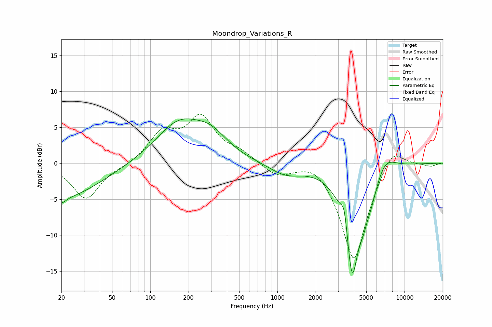

# Moondrop_Variations_R
See [usage instructions](https://github.com/jaakkopasanen/AutoEq#usage) for more options and info.

### Parametric EQs
Apply preamp of -6.3 dB when using parametric equalizer.

|   # | Type    |   Fc (Hz) |    Q |   Gain (dB) |
|-----|---------|-----------|------|-------------|
|   1 | Peaking |        20 | 0.47 |        -4.8 |
|   2 | Peaking |        20 | 4.4  |        -0.8 |
|   3 | Peaking |       167 | 0.77 |         5.3 |
|   4 | Peaking |       301 | 1.07 |         2.7 |
|   5 | Peaking |      1160 | 1.1  |        -1.6 |
|   6 | Peaking |      3376 | 5.03 |         3.8 |
|   7 | Peaking |      3857 | 2.35 |       -15.8 |
|   8 | Peaking |      4707 | 4.66 |        -1.5 |
|   9 | Peaking |      5414 | 2.52 |        -2.8 |
|  10 | Peaking |      6981 | 1.66 |         2.3 |

### Fixed Band EQs
When using fixed band (also called graphic) equalizer, apply preamp of **-6.9 dB** (if available) and set gains manually with these parameters.

|   # | Type    |   Fc (Hz) |    Q |   Gain (dB) |
|-----|---------|-----------|------|-------------|
|   1 | Peaking |        31 | 1.41 |        -5   |
|   2 | Peaking |        62 | 1.41 |        -0.4 |
|   3 | Peaking |       125 | 1.41 |         4   |
|   4 | Peaking |       250 | 1.41 |         6   |
|   5 | Peaking |       500 | 1.41 |         1.3 |
|   6 | Peaking |      1000 | 1.41 |        -1.7 |
|   7 | Peaking |      2000 | 1.41 |         1.3 |
|   8 | Peaking |      4000 | 1.41 |       -13.8 |
|   9 | Peaking |      8000 | 1.41 |         3.2 |
|  10 | Peaking |     16000 | 1.41 |        -0.4 |

### Graphs

