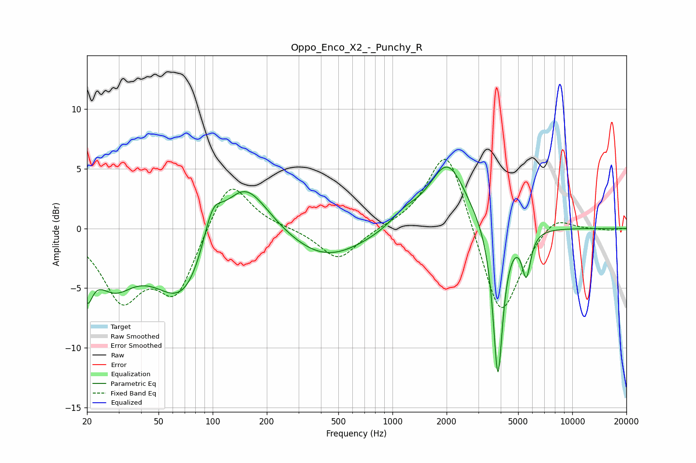

# Oppo_Enco_X2_-_Punchy_R
See [usage instructions](https://github.com/jaakkopasanen/AutoEq#usage) for more options and info.

### Parametric EQs
Apply preamp of -5.2 dB when using parametric equalizer.

|   # | Type    |   Fc (Hz) |    Q |   Gain (dB) |
|-----|---------|-----------|------|-------------|
|   1 | Peaking |        20 | 4.68 |        -3.4 |
|   2 | Peaking |        28 | 1.26 |        -3.8 |
|   3 | Peaking |        70 | 0.86 |        -6.5 |
|   4 | Peaking |       100 | 2.57 |         3.5 |
|   5 | Peaking |       148 | 1.03 |         5.4 |
|   6 | Peaking |       421 | 0.65 |        -2.7 |
|   7 | Peaking |      1160 | 1.88 |         1   |
|   8 | Peaking |      2024 | 1.35 |         5.6 |
|   9 | Peaking |      3857 | 5.13 |       -13.2 |
|  10 | Peaking |      5552 | 5.86 |        -3.6 |

### Fixed Band EQs
When using fixed band (also called graphic) equalizer, apply preamp of **-5.9 dB** (if available) and set gains manually with these parameters.

|   # | Type    |   Fc (Hz) |    Q |   Gain (dB) |
|-----|---------|-----------|------|-------------|
|   1 | Peaking |        31 | 1.41 |        -5.5 |
|   2 | Peaking |        62 | 1.41 |        -5.3 |
|   3 | Peaking |       125 | 1.41 |         4.5 |
|   4 | Peaking |       250 | 1.41 |         0.1 |
|   5 | Peaking |       500 | 1.41 |        -2.7 |
|   6 | Peaking |      1000 | 1.41 |         0.1 |
|   7 | Peaking |      2000 | 1.41 |         7.3 |
|   8 | Peaking |      4000 | 1.41 |        -8.1 |
|   9 | Peaking |      8000 | 1.41 |         1.4 |
|  10 | Peaking |     16000 | 1.41 |        -0.1 |

### Graphs

