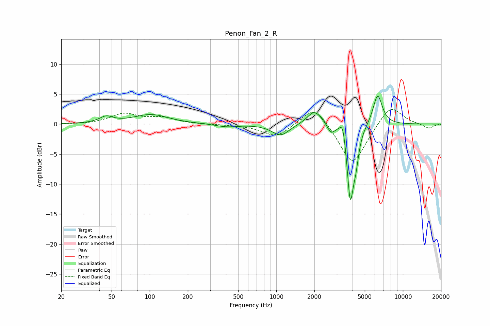

# Penon_Fan_2_R
See [usage instructions](https://github.com/jaakkopasanen/AutoEq#usage) for more options and info.

### Parametric EQs
Apply preamp of -4.7 dB when using parametric equalizer.

|   # | Type    |   Fc (Hz) |    Q |   Gain (dB) |
|-----|---------|-----------|------|-------------|
|   1 | Peaking |        45 | 2.72 |         1   |
|   2 | Peaking |       102 | 1.04 |         1.6 |
|   3 | Peaking |       404 | 1.6  |        -0.5 |
|   4 | Peaking |      1082 | 2.08 |        -1.9 |
|   5 | Peaking |      2003 | 2.46 |         2.5 |
|   6 | Peaking |      2699 | 5.32 |        -1.4 |
|   7 | Peaking |      3359 | 5.68 |         3.4 |
|   8 | Peaking |      3837 | 5.15 |       -12.6 |
|   9 | Peaking |      4246 | 6    |        -3.5 |
|  10 | Peaking |      6314 | 3.75 |         5.2 |

### Fixed Band EQs
When using fixed band (also called graphic) equalizer, apply preamp of **-2.5 dB** (if available) and set gains manually with these parameters.

|   # | Type    |   Fc (Hz) |    Q |   Gain (dB) |
|-----|---------|-----------|------|-------------|
|   1 | Peaking |        31 | 1.41 |        -0.1 |
|   2 | Peaking |        62 | 1.41 |         1.7 |
|   3 | Peaking |       125 | 1.41 |         1   |
|   4 | Peaking |       250 | 1.41 |        -0   |
|   5 | Peaking |       500 | 1.41 |        -0.1 |
|   6 | Peaking |      1000 | 1.41 |        -2.2 |
|   7 | Peaking |      2000 | 1.41 |         3.5 |
|   8 | Peaking |      4000 | 1.41 |        -7.1 |
|   9 | Peaking |      8000 | 1.41 |         3.4 |
|  10 | Peaking |     16000 | 1.41 |        -0.7 |

### Graphs

