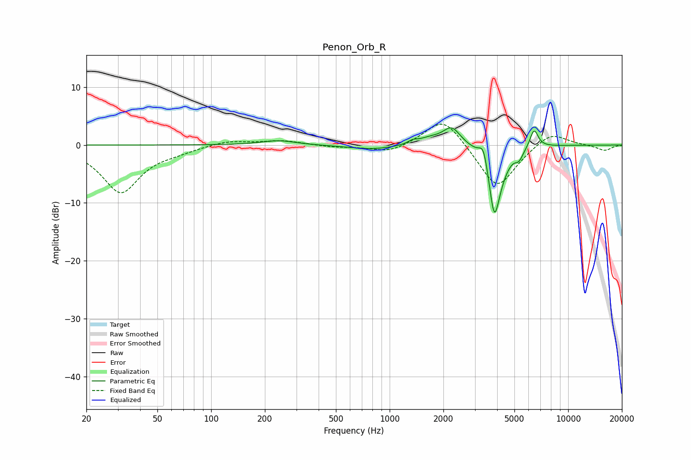

# Penon_Orb_R
See [usage instructions](https://github.com/jaakkopasanen/AutoEq#usage) for more options and info.

### Parametric EQs
Apply preamp of -3.1 dB when using parametric equalizer.

|   # | Type    |   Fc (Hz) |    Q |   Gain (dB) |
|-----|---------|-----------|------|-------------|
|   1 | Peaking |       239 | 1.47 |         0.8 |
|   2 | Peaking |       808 | 1.01 |        -0.8 |
|   3 | Peaking |      1344 | 5.47 |         0.5 |
|   4 | Peaking |      1680 | 1.99 |         1.1 |
|   5 | Peaking |      2230 | 2.89 |         3   |
|   6 | Peaking |      3354 | 5.92 |         3.2 |
|   7 | Peaking |      3857 | 4.42 |       -11.4 |
|   8 | Peaking |      4248 | 3.12 |        -1.8 |
|   9 | Peaking |      5309 | 6    |        -1.6 |
|  10 | Peaking |      6441 | 5.98 |         3.2 |

### Fixed Band EQs
When using fixed band (also called graphic) equalizer, apply preamp of **-3.7 dB** (if available) and set gains manually with these parameters.

|   # | Type    |   Fc (Hz) |    Q |   Gain (dB) |
|-----|---------|-----------|------|-------------|
|   1 | Peaking |        31 | 1.41 |        -8.1 |
|   2 | Peaking |        62 | 1.41 |        -0.7 |
|   3 | Peaking |       125 | 1.41 |         0.8 |
|   4 | Peaking |       250 | 1.41 |         0.8 |
|   5 | Peaking |       500 | 1.41 |        -0.3 |
|   6 | Peaking |      1000 | 1.41 |        -1.4 |
|   7 | Peaking |      2000 | 1.41 |         5.2 |
|   8 | Peaking |      4000 | 1.41 |        -7.9 |
|   9 | Peaking |      8000 | 1.41 |         2.5 |
|  10 | Peaking |     16000 | 1.41 |        -1   |

### Graphs

