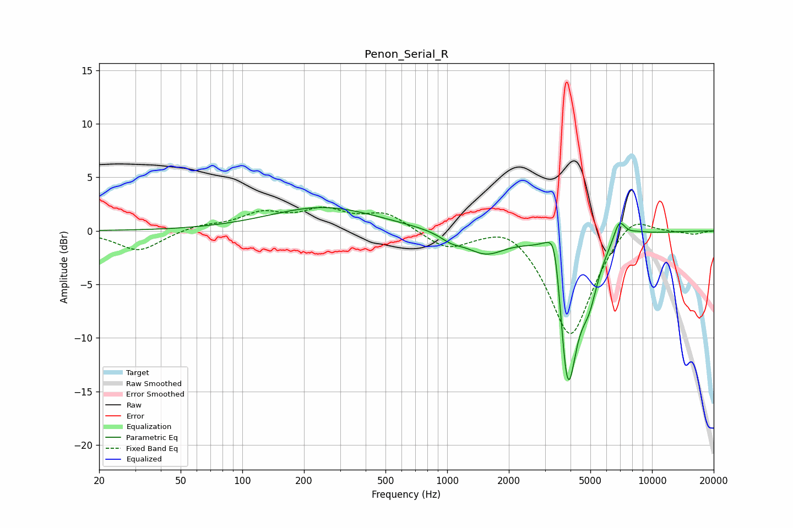

# Penon_Serial_R
See [usage instructions](https://github.com/jaakkopasanen/AutoEq#usage) for more options and info.

### Parametric EQs
Apply preamp of -2.3 dB when using parametric equalizer.

|   # | Type    |   Fc (Hz) |    Q |   Gain (dB) |
|-----|---------|-----------|------|-------------|
|   1 | Peaking |       249 | 0.54 |         2.2 |
|   2 | Peaking |      1050 | 2.59 |        -0.7 |
|   3 | Peaking |      1539 | 1.47 |        -1.9 |
|   4 | Peaking |      3164 | 2.48 |         2.2 |
|   5 | Peaking |      3358 | 4.93 |         3.9 |
|   6 | Peaking |      3778 | 6    |        -2   |
|   7 | Peaking |      3914 | 2.88 |       -13.2 |
|   8 | Peaking |      4924 | 3.21 |        -3.6 |
|   9 | Peaking |      6916 | 4.67 |         2   |
|  10 | Peaking |      8353 | 2.18 |         0.3 |

### Fixed Band EQs
When using fixed band (also called graphic) equalizer, apply preamp of **-2.3 dB** (if available) and set gains manually with these parameters.

|   # | Type    |   Fc (Hz) |    Q |   Gain (dB) |
|-----|---------|-----------|------|-------------|
|   1 | Peaking |        31 | 1.41 |        -1.9 |
|   2 | Peaking |        62 | 1.41 |         0.5 |
|   3 | Peaking |       125 | 1.41 |         1.5 |
|   4 | Peaking |       250 | 1.41 |         1.7 |
|   5 | Peaking |       500 | 1.41 |         1.6 |
|   6 | Peaking |      1000 | 1.41 |        -1.7 |
|   7 | Peaking |      2000 | 1.41 |         1.3 |
|   8 | Peaking |      4000 | 1.41 |       -10.1 |
|   9 | Peaking |      8000 | 1.41 |         2.1 |
|  10 | Peaking |     16000 | 1.41 |        -0.3 |

### Graphs

