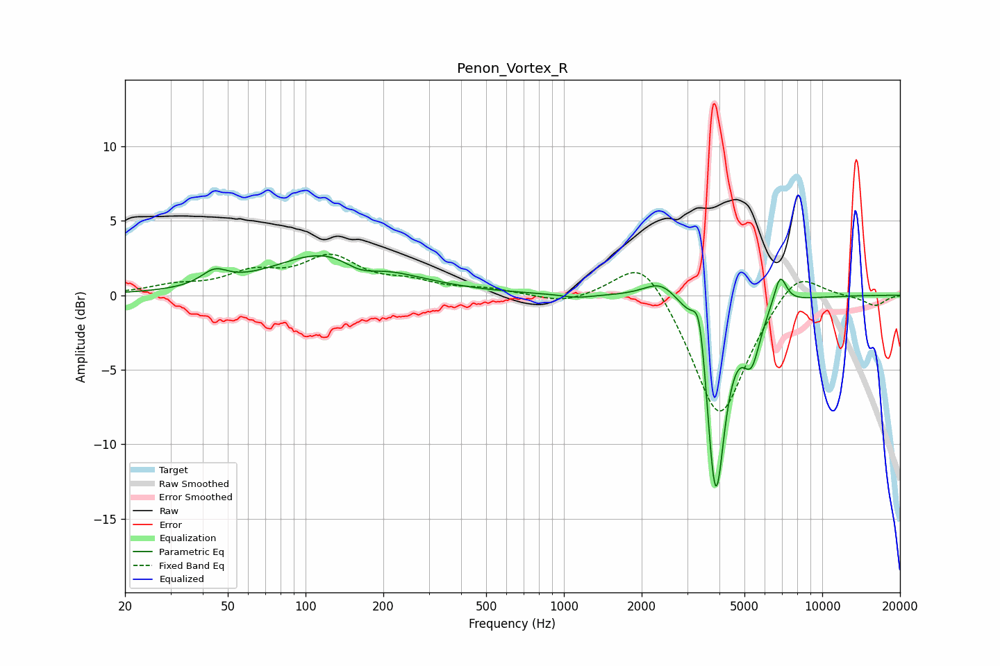

# Penon_Vortex_R
See [usage instructions](https://github.com/jaakkopasanen/AutoEq#usage) for more options and info.

### Parametric EQs
Apply preamp of -2.7 dB when using parametric equalizer.

|   # | Type    |   Fc (Hz) |    Q |   Gain (dB) |
|-----|---------|-----------|------|-------------|
|   1 | Peaking |        44 | 2.82 |         1   |
|   2 | Peaking |       130 | 0.66 |         3.1 |
|   3 | Peaking |       162 | 1.82 |        -1.2 |
|   4 | Peaking |      1122 | 2.37 |        -0.2 |
|   5 | Peaking |      2391 | 2.06 |         1.3 |
|   6 | Peaking |      3352 | 5.55 |         3.4 |
|   7 | Peaking |      3736 | 6    |        -1.8 |
|   8 | Peaking |      3891 | 3.88 |       -12.2 |
|   9 | Peaking |      5324 | 4.01 |        -3.3 |
|  10 | Peaking |      6870 | 5.53 |         2.1 |

### Fixed Band EQs
When using fixed band (also called graphic) equalizer, apply preamp of **-2.8 dB** (if available) and set gains manually with these parameters.

|   # | Type    |   Fc (Hz) |    Q |   Gain (dB) |
|-----|---------|-----------|------|-------------|
|   1 | Peaking |        31 | 1.41 |         0.5 |
|   2 | Peaking |        62 | 1.41 |         1.3 |
|   3 | Peaking |       125 | 1.41 |         2.4 |
|   4 | Peaking |       250 | 1.41 |         0.7 |
|   5 | Peaking |       500 | 1.41 |         0.4 |
|   6 | Peaking |      1000 | 1.41 |        -0.6 |
|   7 | Peaking |      2000 | 1.41 |         3   |
|   8 | Peaking |      4000 | 1.41 |        -8.6 |
|   9 | Peaking |      8000 | 1.41 |         2.1 |
|  10 | Peaking |     16000 | 1.41 |        -0.7 |

### Graphs

