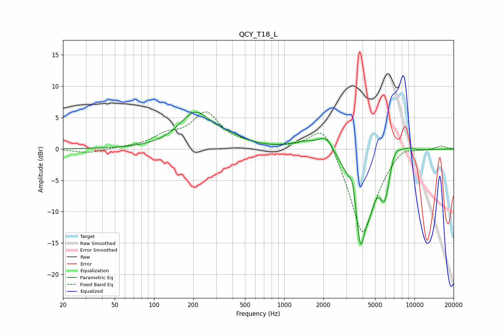

# QCY_T18_L
See [usage instructions](https://github.com/jaakkopasanen/AutoEq#usage) for more options and info.

### Parametric EQs
Apply preamp of -6.0 dB when using parametric equalizer.

|   # | Type    |   Fc (Hz) |    Q |   Gain (dB) |
|-----|---------|-----------|------|-------------|
|   1 | Peaking |       207 | 1.16 |         5.6 |
|   2 | Peaking |       379 | 1.28 |         1.1 |
|   3 | Peaking |      1484 | 1.25 |         1.2 |
|   4 | Peaking |      2098 | 2.52 |         2.3 |
|   5 | Peaking |      3375 | 5.59 |         3.5 |
|   6 | Peaking |      3849 | 2.75 |       -15.4 |
|   7 | Peaking |      4592 | 4.5  |        -2.5 |
|   8 | Peaking |      5926 | 3.4  |        -6.5 |
|   9 | Peaking |      7064 | 3.14 |         2.4 |
|  10 | Peaking |      8930 | 2.36 |         0.7 |

### Fixed Band EQs
When using fixed band (also called graphic) equalizer, apply preamp of **-6.0 dB** (if available) and set gains manually with these parameters.

|   # | Type    |   Fc (Hz) |    Q |   Gain (dB) |
|-----|---------|-----------|------|-------------|
|   1 | Peaking |        31 | 1.41 |        -0.7 |
|   2 | Peaking |        62 | 1.41 |         0.2 |
|   3 | Peaking |       125 | 1.41 |         1.8 |
|   4 | Peaking |       250 | 1.41 |         5.5 |
|   5 | Peaking |       500 | 1.41 |         0.5 |
|   6 | Peaking |      1000 | 1.41 |         0.1 |
|   7 | Peaking |      2000 | 1.41 |         5.1 |
|   8 | Peaking |      4000 | 1.41 |       -14.4 |
|   9 | Peaking |      8000 | 1.41 |         1.6 |
|  10 | Peaking |     16000 | 1.41 |         0.6 |

### Graphs

