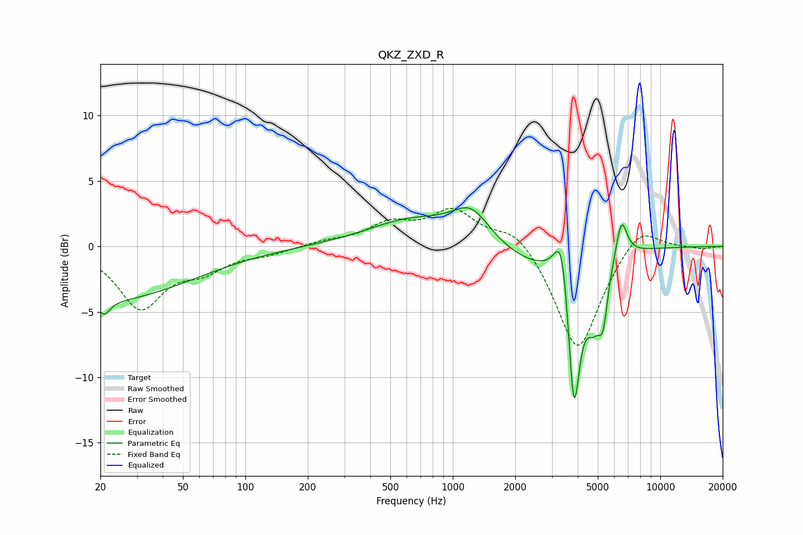

# QKZ_ZXD_R
See [usage instructions](https://github.com/jaakkopasanen/AutoEq#usage) for more options and info.

### Parametric EQs
Apply preamp of -3.1 dB when using parametric equalizer.

|   # | Type    |   Fc (Hz) |    Q |   Gain (dB) |
|-----|---------|-----------|------|-------------|
|   1 | Peaking |        20 | 0.32 |        -4.1 |
|   2 | Peaking |        21 | 5.21 |        -1   |
|   3 | Peaking |       636 | 0.66 |         2   |
|   4 | Peaking |      1224 | 1.56 |         2.4 |
|   5 | Peaking |      2368 | 0.84 |        -1.4 |
|   6 | Peaking |      3357 | 4.13 |         4.6 |
|   7 | Peaking |      3836 | 4.64 |       -12   |
|   8 | Peaking |      4750 | 3.68 |        -3.5 |
|   9 | Peaking |      5298 | 5.9  |        -3.7 |
|  10 | Peaking |      6503 | 5.03 |         3   |

### Fixed Band EQs
When using fixed band (also called graphic) equalizer, apply preamp of **-3.0 dB** (if available) and set gains manually with these parameters.

|   # | Type    |   Fc (Hz) |    Q |   Gain (dB) |
|-----|---------|-----------|------|-------------|
|   1 | Peaking |        31 | 1.41 |        -4.6 |
|   2 | Peaking |        62 | 1.41 |        -1.5 |
|   3 | Peaking |       125 | 1.41 |        -0.5 |
|   4 | Peaking |       250 | 1.41 |         0.3 |
|   5 | Peaking |       500 | 1.41 |         1.6 |
|   6 | Peaking |      1000 | 1.41 |         2.6 |
|   7 | Peaking |      2000 | 1.41 |         1.6 |
|   8 | Peaking |      4000 | 1.41 |        -8.2 |
|   9 | Peaking |      8000 | 1.41 |         1.9 |
|  10 | Peaking |     16000 | 1.41 |        -0.2 |

### Graphs

