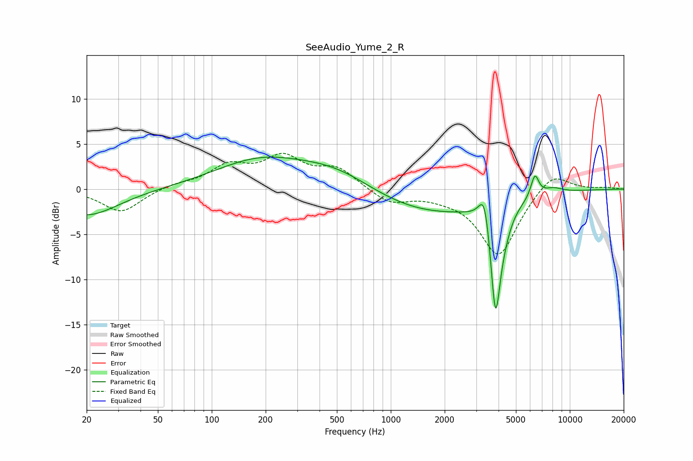

# SeeAudio_Yume_2_R
See [usage instructions](https://github.com/jaakkopasanen/AutoEq#usage) for more options and info.

### Parametric EQs
Apply preamp of -3.6 dB when using parametric equalizer.

|   # | Type    |   Fc (Hz) |    Q |   Gain (dB) |
|-----|---------|-----------|------|-------------|
|   1 | Peaking |        20 | 0.8  |        -3   |
|   2 | Peaking |       185 | 0.56 |         3   |
|   3 | Peaking |       506 | 0.64 |         2.3 |
|   4 | Peaking |      1584 | 0.4  |        -2.8 |
|   5 | Peaking |      3341 | 4.64 |         4   |
|   6 | Peaking |      3846 | 4.89 |       -12.2 |
|   7 | Peaking |      4285 | 3.21 |        -1.5 |
|   8 | Peaking |      6385 | 5.97 |         2.5 |
|   9 | Peaking |      6648 | 3.84 |        -0.1 |
|  10 | Peaking |      8041 | 2.41 |         0.6 |

### Fixed Band EQs
When using fixed band (also called graphic) equalizer, apply preamp of **-4.1 dB** (if available) and set gains manually with these parameters.

|   # | Type    |   Fc (Hz) |    Q |   Gain (dB) |
|-----|---------|-----------|------|-------------|
|   1 | Peaking |        31 | 1.41 |        -2.6 |
|   2 | Peaking |        62 | 1.41 |         0.5 |
|   3 | Peaking |       125 | 1.41 |         2.3 |
|   4 | Peaking |       250 | 1.41 |         3.2 |
|   5 | Peaking |       500 | 1.41 |         2.1 |
|   6 | Peaking |      1000 | 1.41 |        -1.6 |
|   7 | Peaking |      2000 | 1.41 |        -0.5 |
|   8 | Peaking |      4000 | 1.41 |        -7.4 |
|   9 | Peaking |      8000 | 1.41 |         2.2 |
|  10 | Peaking |     16000 | 1.41 |         0.2 |

### Graphs

