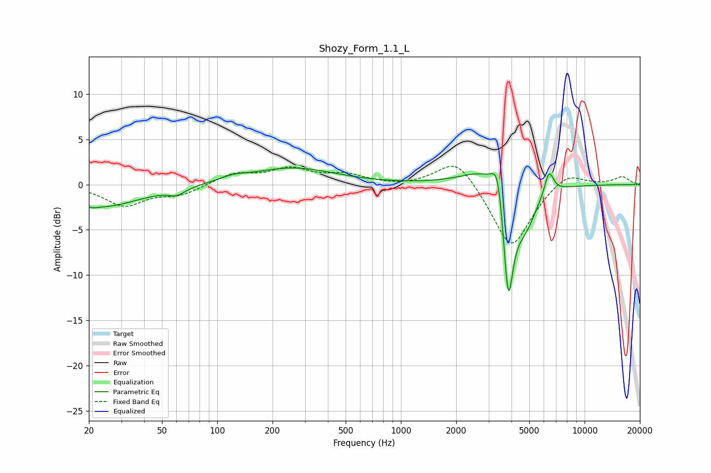

# Shozy_Form_1.1_L
See [usage instructions](https://github.com/jaakkopasanen/AutoEq#usage) for more options and info.

### Parametric EQs
Apply preamp of -1.9 dB when using parametric equalizer.

|   # | Type    |   Fc (Hz) |    Q |   Gain (dB) |
|-----|---------|-----------|------|-------------|
|   1 | Peaking |        21 | 5.22 |        -0.2 |
|   2 | Peaking |        24 | 0.67 |        -2.4 |
|   3 | Peaking |        60 | 3.13 |        -0.7 |
|   4 | Peaking |       122 | 2.02 |         0.5 |
|   5 | Peaking |       257 | 0.62 |         1.8 |
|   6 | Peaking |      2913 | 1.16 |         2.1 |
|   7 | Peaking |      3363 | 4.68 |         4.1 |
|   8 | Peaking |      3841 | 4.89 |       -12.5 |
|   9 | Peaking |      4722 | 2.11 |        -4.4 |
|  10 | Peaking |      6402 | 5.59 |         2.6 |

### Fixed Band EQs
When using fixed band (also called graphic) equalizer, apply preamp of **-2.1 dB** (if available) and set gains manually with these parameters.

|   # | Type    |   Fc (Hz) |    Q |   Gain (dB) |
|-----|---------|-----------|------|-------------|
|   1 | Peaking |        31 | 1.41 |        -2.3 |
|   2 | Peaking |        62 | 1.41 |        -1.1 |
|   3 | Peaking |       125 | 1.41 |         1.2 |
|   4 | Peaking |       250 | 1.41 |         1.6 |
|   5 | Peaking |       500 | 1.41 |         1   |
|   6 | Peaking |      1000 | 1.41 |        -0.2 |
|   7 | Peaking |      2000 | 1.41 |         3.2 |
|   8 | Peaking |      4000 | 1.41 |        -7.2 |
|   9 | Peaking |      8000 | 1.41 |         1.6 |
|  10 | Peaking |     16000 | 1.41 |         0.9 |

### Graphs

