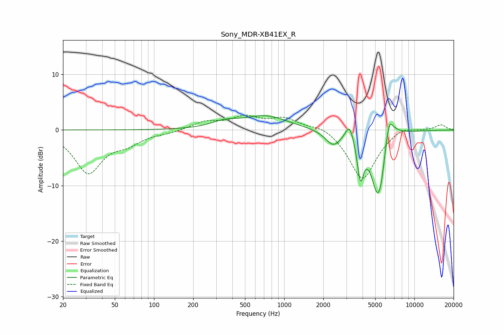

# Sony_MDR-XB41EX_R
See [usage instructions](https://github.com/jaakkopasanen/AutoEq#usage) for more options and info.

### Parametric EQs
Apply preamp of -2.7 dB when using parametric equalizer.

|   # | Type    |   Fc (Hz) |    Q |   Gain (dB) |
|-----|---------|-----------|------|-------------|
|   1 | Peaking |       347 | 1.4  |         1.1 |
|   2 | Peaking |       723 | 0.83 |         2.5 |
|   3 | Peaking |      2377 | 2.44 |        -2.6 |
|   4 | Peaking |      3177 | 4.5  |         3.1 |
|   5 | Peaking |      3850 | 5.94 |        -6.9 |
|   6 | Peaking |      5188 | 2.58 |       -11   |
|   7 | Peaking |      5537 | 6    |        -2.1 |
|   8 | Peaking |      6391 | 5.73 |         3.3 |
|   9 | Peaking |      6583 | 2.23 |         1.7 |
|  10 | Peaking |      6767 | 2.29 |         0.9 |

### Fixed Band EQs
When using fixed band (also called graphic) equalizer, apply preamp of **-2.8 dB** (if available) and set gains manually with these parameters.

|   # | Type    |   Fc (Hz) |    Q |   Gain (dB) |
|-----|---------|-----------|------|-------------|
|   1 | Peaking |        31 | 1.41 |        -7.5 |
|   2 | Peaking |        62 | 1.41 |        -1.9 |
|   3 | Peaking |       125 | 1.41 |        -0.4 |
|   4 | Peaking |       250 | 1.41 |         1.4 |
|   5 | Peaking |       500 | 1.41 |         2.1 |
|   6 | Peaking |      1000 | 1.41 |         2   |
|   7 | Peaking |      2000 | 1.41 |         1.1 |
|   8 | Peaking |      4000 | 1.41 |        -9.1 |
|   9 | Peaking |      8000 | 1.41 |         1   |
|  10 | Peaking |     16000 | 1.41 |         1   |

### Graphs

