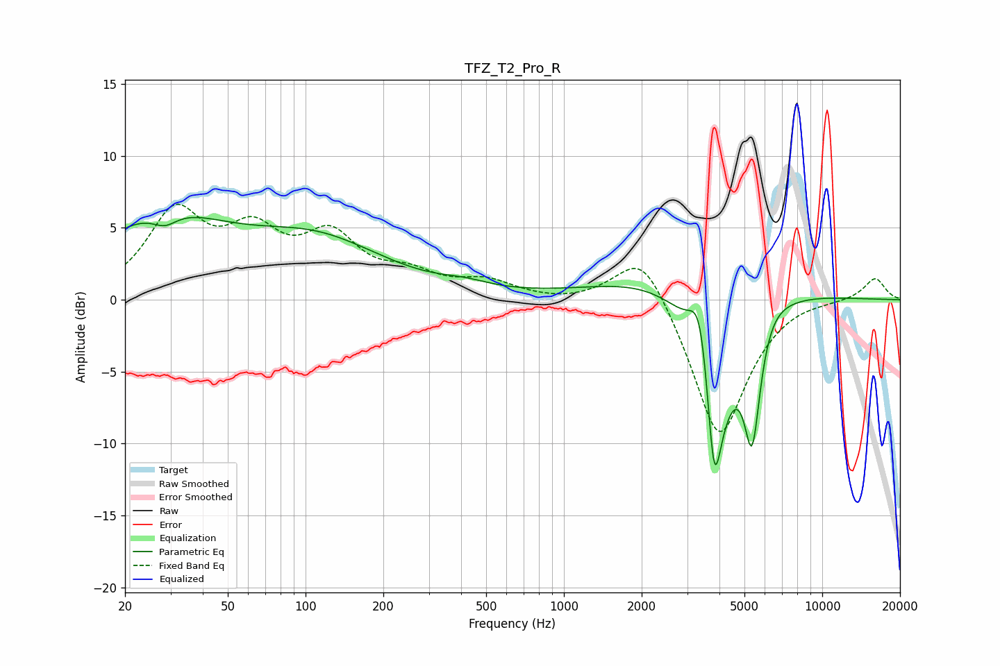

# TFZ_T2_Pro_R
See [usage instructions](https://github.com/jaakkopasanen/AutoEq#usage) for more options and info.

### Parametric EQs
Apply preamp of -5.8 dB when using parametric equalizer.

|   # | Type    |   Fc (Hz) |    Q |   Gain (dB) |
|-----|---------|-----------|------|-------------|
|   1 | Peaking |        27 | 0.54 |         5.3 |
|   2 | Peaking |        28 | 2.95 |        -0.9 |
|   3 | Peaking |       112 | 0.53 |         3.7 |
|   4 | Peaking |       415 | 1.41 |         0.5 |
|   5 | Peaking |      3232 | 0.46 |         2.6 |
|   6 | Peaking |      3384 | 3.32 |         5.9 |
|   7 | Peaking |      3814 | 6    |        -5.9 |
|   8 | Peaking |      3865 | 1.65 |       -10.8 |
|   9 | Peaking |      5355 | 4.36 |        -8.3 |
|  10 | Peaking |      6280 | 2.22 |         0.7 |

### Fixed Band EQs
When using fixed band (also called graphic) equalizer, apply preamp of **-6.7 dB** (if available) and set gains manually with these parameters.

|   # | Type    |   Fc (Hz) |    Q |   Gain (dB) |
|-----|---------|-----------|------|-------------|
|   1 | Peaking |        31 | 1.41 |         5.7 |
|   2 | Peaking |        62 | 1.41 |         3.9 |
|   3 | Peaking |       125 | 1.41 |         3.9 |
|   4 | Peaking |       250 | 1.41 |         1.4 |
|   5 | Peaking |       500 | 1.41 |         1.1 |
|   6 | Peaking |      1000 | 1.41 |        -0.2 |
|   7 | Peaking |      2000 | 1.41 |         3.9 |
|   8 | Peaking |      4000 | 1.41 |        -9.9 |
|   9 | Peaking |      8000 | 1.41 |         0.2 |
|  10 | Peaking |     16000 | 1.41 |         1.6 |

### Graphs

