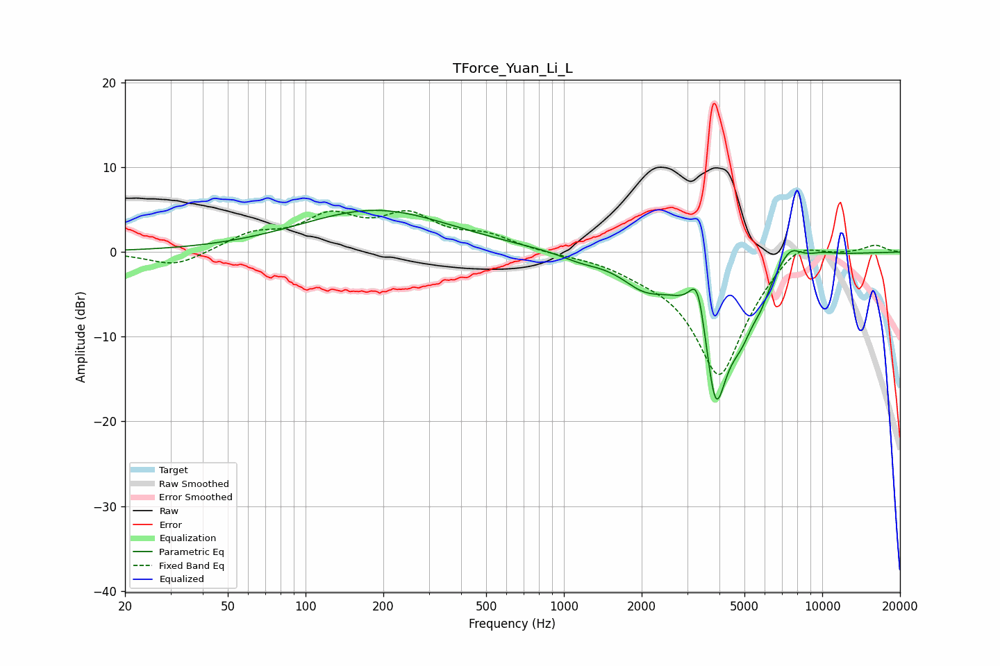

# TForce_Yuan_Li_L
See [usage instructions](https://github.com/jaakkopasanen/AutoEq#usage) for more options and info.

### Parametric EQs
Apply preamp of -5.0 dB when using parametric equalizer.

|   # | Type    |   Fc (Hz) |    Q |   Gain (dB) |
|-----|---------|-----------|------|-------------|
|   1 | Peaking |       187 | 0.48 |         4.9 |
|   2 | Peaking |      1162 | 1.74 |        -0.7 |
|   3 | Peaking |      2047 | 1.56 |        -2.9 |
|   4 | Peaking |      3266 | 4.25 |         4.3 |
|   5 | Peaking |      3344 | 5.55 |         2.1 |
|   6 | Peaking |      3870 | 2.46 |       -17.2 |
|   7 | Peaking |      4901 | 2.69 |        -4.1 |
|   8 | Peaking |      5792 | 4.43 |        -1.6 |
|   9 | Peaking |      7505 | 3.02 |         2.2 |
|  10 | Peaking |     10000 | 2.29 |         0.4 |

### Fixed Band EQs
When using fixed band (also called graphic) equalizer, apply preamp of **-5.0 dB** (if available) and set gains manually with these parameters.

|   # | Type    |   Fc (Hz) |    Q |   Gain (dB) |
|-----|---------|-----------|------|-------------|
|   1 | Peaking |        31 | 1.41 |        -1.8 |
|   2 | Peaking |        62 | 1.41 |         1.9 |
|   3 | Peaking |       125 | 1.41 |         3.8 |
|   4 | Peaking |       250 | 1.41 |         3.9 |
|   5 | Peaking |       500 | 1.41 |         1.7 |
|   6 | Peaking |      1000 | 1.41 |        -0.1 |
|   7 | Peaking |      2000 | 1.41 |        -1   |
|   8 | Peaking |      4000 | 1.41 |       -14.7 |
|   9 | Peaking |      8000 | 1.41 |         2.5 |
|  10 | Peaking |     16000 | 1.41 |         0.9 |

### Graphs

