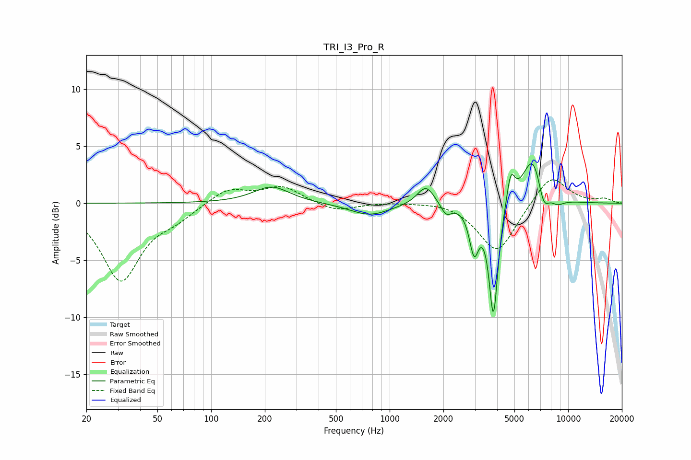

# TRI_I3_Pro_R
See [usage instructions](https://github.com/jaakkopasanen/AutoEq#usage) for more options and info.

### Parametric EQs
Apply preamp of -3.6 dB when using parametric equalizer.

|   # | Type    |   Fc (Hz) |    Q |   Gain (dB) |
|-----|---------|-----------|------|-------------|
|   1 | Peaking |       218 | 1.4  |         1.5 |
|   2 | Peaking |       773 | 1.27 |        -1.1 |
|   3 | Peaking |      1595 | 2.95 |         1.7 |
|   4 | Peaking |      2071 | 4.84 |        -1   |
|   5 | Peaking |      2972 | 5.4  |        -3.8 |
|   6 | Peaking |      3815 | 5.64 |        -9.9 |
|   7 | Peaking |      4765 | 6    |         2.7 |
|   8 | Peaking |      6349 | 2.37 |         4.3 |
|   9 | Peaking |      7274 | 4.4  |        -2.2 |
|  10 | Peaking |      8669 | 3.27 |        -0.6 |

### Fixed Band EQs
When using fixed band (also called graphic) equalizer, apply preamp of **-2.2 dB** (if available) and set gains manually with these parameters.

|   # | Type    |   Fc (Hz) |    Q |   Gain (dB) |
|-----|---------|-----------|------|-------------|
|   1 | Peaking |        31 | 1.41 |        -6.7 |
|   2 | Peaking |        62 | 1.41 |        -1   |
|   3 | Peaking |       125 | 1.41 |         1.3 |
|   4 | Peaking |       250 | 1.41 |         1.4 |
|   5 | Peaking |       500 | 1.41 |        -0.8 |
|   6 | Peaking |      1000 | 1.41 |         0.1 |
|   7 | Peaking |      2000 | 1.41 |         0.2 |
|   8 | Peaking |      4000 | 1.41 |        -4.4 |
|   9 | Peaking |      8000 | 1.41 |         2.6 |
|  10 | Peaking |     16000 | 1.41 |         0.4 |

### Graphs

