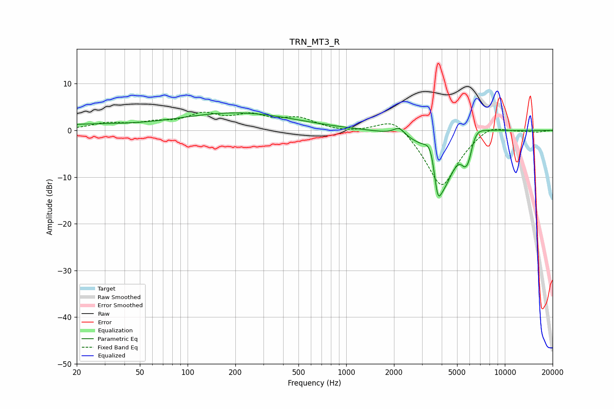

# TRN_MT3_R
See [usage instructions](https://github.com/jaakkopasanen/AutoEq#usage) for more options and info.

### Parametric EQs
Apply preamp of -3.8 dB when using parametric equalizer.

|   # | Type    |   Fc (Hz) |    Q |   Gain (dB) |
|-----|---------|-----------|------|-------------|
|   1 | Peaking |        21 | 0.47 |         1.1 |
|   2 | Peaking |       204 | 0.38 |         3.7 |
|   3 | Peaking |      2157 | 4.03 |         1.7 |
|   4 | Peaking |      3423 | 3.65 |         5.3 |
|   5 | Peaking |      3765 | 6    |        -6.8 |
|   6 | Peaking |      4087 | 1.77 |       -11.7 |
|   7 | Peaking |      5565 | 6    |        -2.2 |
|   8 | Peaking |      5900 | 5.54 |        -3.7 |
|   9 | Peaking |      6558 | 2.71 |         2.4 |
|  10 | Peaking |      7922 | 1.14 |         0.8 |

### Fixed Band EQs
When using fixed band (also called graphic) equalizer, apply preamp of **-4.0 dB** (if available) and set gains manually with these parameters.

|   # | Type    |   Fc (Hz) |    Q |   Gain (dB) |
|-----|---------|-----------|------|-------------|
|   1 | Peaking |        31 | 1.41 |         1.4 |
|   2 | Peaking |        62 | 1.41 |         1.3 |
|   3 | Peaking |       125 | 1.41 |         3   |
|   4 | Peaking |       250 | 1.41 |         2.7 |
|   5 | Peaking |       500 | 1.41 |         2.3 |
|   6 | Peaking |      1000 | 1.41 |        -0.4 |
|   7 | Peaking |      2000 | 1.41 |         3.6 |
|   8 | Peaking |      4000 | 1.41 |       -12.5 |
|   9 | Peaking |      8000 | 1.41 |         2   |
|  10 | Peaking |     16000 | 1.41 |        -0.3 |

### Graphs

