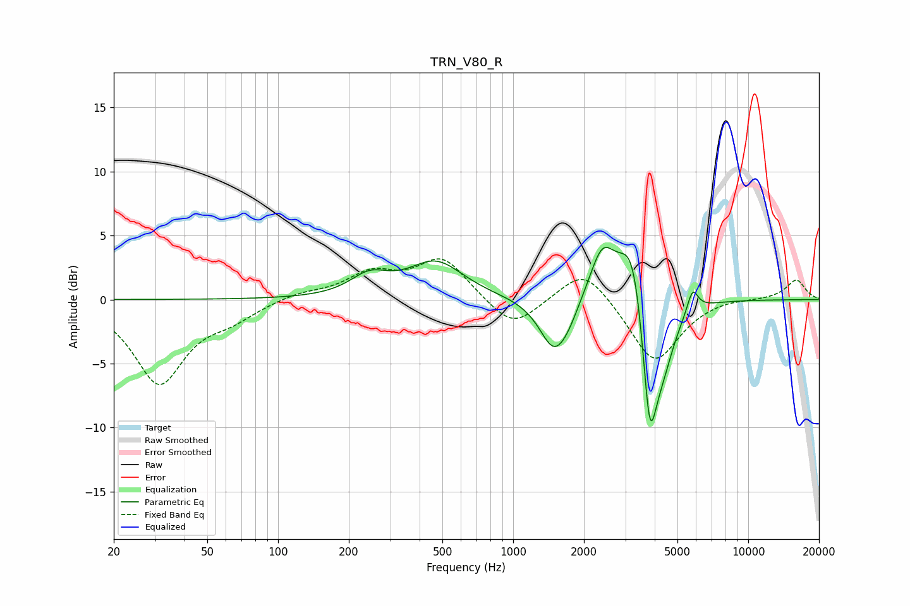

# TRN_V80_R
See [usage instructions](https://github.com/jaakkopasanen/AutoEq#usage) for more options and info.

### Parametric EQs
Apply preamp of -4.2 dB when using parametric equalizer.

|   # | Type    |   Fc (Hz) |    Q |   Gain (dB) |
|-----|---------|-----------|------|-------------|
|   1 | Peaking |       245 | 1.75 |         1.5 |
|   2 | Peaking |       470 | 1.21 |         2.9 |
|   3 | Peaking |      1495 | 2.26 |        -4.1 |
|   4 | Peaking |      1724 | 2.59 |        -0.3 |
|   5 | Peaking |      1726 | 3.42 |        -0.5 |
|   6 | Peaking |      2393 | 2.59 |         3.9 |
|   7 | Peaking |      3242 | 2.43 |         5.9 |
|   8 | Peaking |      3808 | 4.38 |       -10   |
|   9 | Peaking |      4302 | 2.47 |        -4.6 |
|  10 | Peaking |      5797 | 6    |         1.8 |

### Fixed Band EQs
When using fixed band (also called graphic) equalizer, apply preamp of **-3.3 dB** (if available) and set gains manually with these parameters.

|   # | Type    |   Fc (Hz) |    Q |   Gain (dB) |
|-----|---------|-----------|------|-------------|
|   1 | Peaking |        31 | 1.41 |        -6.5 |
|   2 | Peaking |        62 | 1.41 |        -1.2 |
|   3 | Peaking |       125 | 1.41 |         0.5 |
|   4 | Peaking |       250 | 1.41 |         1.9 |
|   5 | Peaking |       500 | 1.41 |         3.2 |
|   6 | Peaking |      1000 | 1.41 |        -2.4 |
|   7 | Peaking |      2000 | 1.41 |         2.7 |
|   8 | Peaking |      4000 | 1.41 |        -5   |
|   9 | Peaking |      8000 | 1.41 |         0.2 |
|  10 | Peaking |     16000 | 1.41 |         1.6 |

### Graphs

