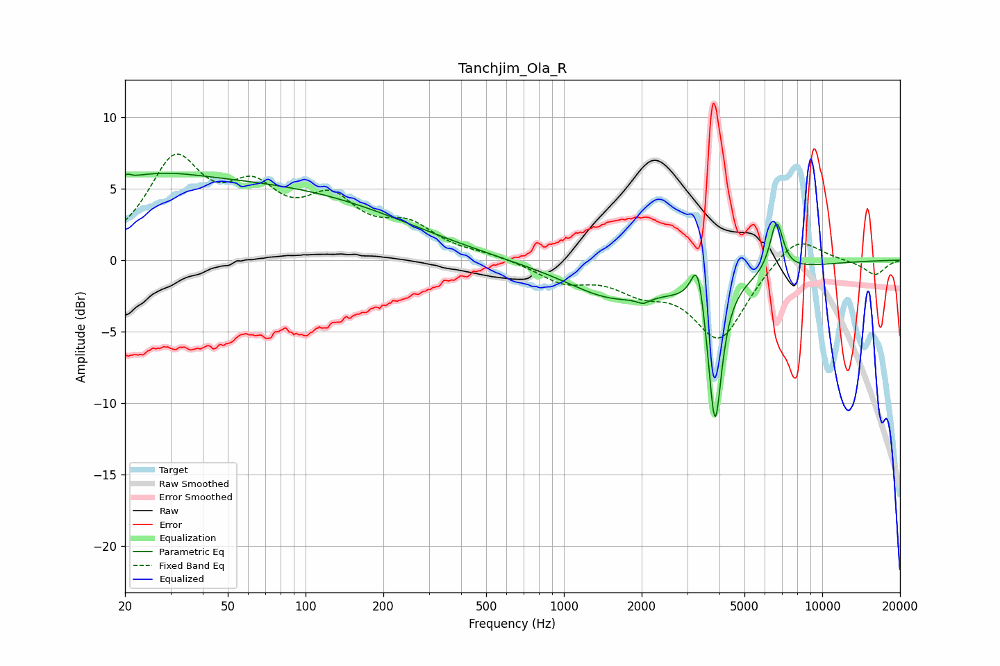

# Tanchjim_Ola_R
See [usage instructions](https://github.com/jaakkopasanen/AutoEq#usage) for more options and info.

### Parametric EQs
Apply preamp of -6.2 dB when using parametric equalizer.

|   # | Type    |   Fc (Hz) |    Q |   Gain (dB) |
|-----|---------|-----------|------|-------------|
|   1 | Peaking |        21 | 5.9  |         3   |
|   2 | Peaking |        21 | 5.99 |        -2.6 |
|   3 | Peaking |        25 | 0.83 |         1   |
|   4 | Peaking |        46 | 0.19 |         5.3 |
|   5 | Peaking |      1465 | 0.99 |        -1.1 |
|   6 | Peaking |      2030 | 5.93 |        -0.4 |
|   7 | Peaking |      2328 | 0.44 |        -1.9 |
|   8 | Peaking |      3295 | 5.58 |         3.4 |
|   9 | Peaking |      3845 | 5.45 |       -10.2 |
|  10 | Peaking |      6652 | 5.31 |         3.6 |

### Fixed Band EQs
When using fixed band (also called graphic) equalizer, apply preamp of **-7.5 dB** (if available) and set gains manually with these parameters.

|   # | Type    |   Fc (Hz) |    Q |   Gain (dB) |
|-----|---------|-----------|------|-------------|
|   1 | Peaking |        31 | 1.41 |         6.5 |
|   2 | Peaking |        62 | 1.41 |         3.9 |
|   3 | Peaking |       125 | 1.41 |         3.5 |
|   4 | Peaking |       250 | 1.41 |         2   |
|   5 | Peaking |       500 | 1.41 |         0.3 |
|   6 | Peaking |      1000 | 1.41 |        -1.4 |
|   7 | Peaking |      2000 | 1.41 |        -1.7 |
|   8 | Peaking |      4000 | 1.41 |        -5.4 |
|   9 | Peaking |      8000 | 1.41 |         2   |
|  10 | Peaking |     16000 | 1.41 |        -1   |

### Graphs

