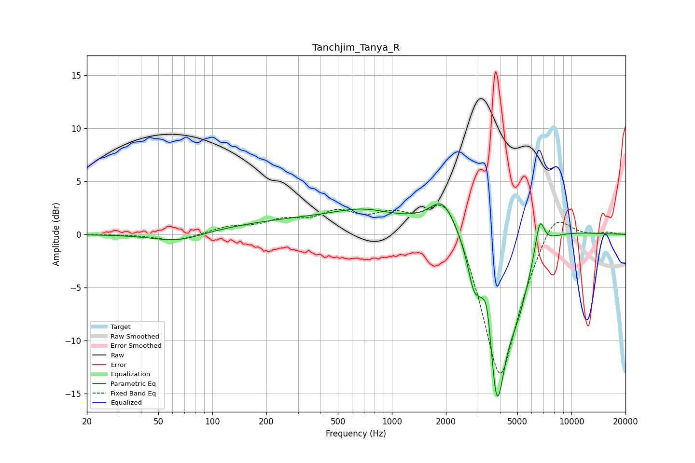

# Tanchjim_Tanya_R
See [usage instructions](https://github.com/jaakkopasanen/AutoEq#usage) for more options and info.

### Parametric EQs
Apply preamp of -3.0 dB when using parametric equalizer.

|   # | Type    |   Fc (Hz) |    Q |   Gain (dB) |
|-----|---------|-----------|------|-------------|
|   1 | Peaking |        64 | 0.98 |        -0.9 |
|   2 | Peaking |       419 | 0.26 |         1.5 |
|   3 | Peaking |       685 | 0.92 |         0.9 |
|   4 | Peaking |      1928 | 1.95 |         2.9 |
|   5 | Peaking |      2851 | 4.7  |        -2.4 |
|   6 | Peaking |      3402 | 5.63 |         3.4 |
|   7 | Peaking |      3836 | 2.26 |       -17.6 |
|   8 | Peaking |      4277 | 0.57 |         2.9 |
|   9 | Peaking |      5062 | 1.95 |        -4.7 |
|  10 | Peaking |      6663 | 5.39 |         3.2 |

### Fixed Band EQs
When using fixed band (also called graphic) equalizer, apply preamp of **-2.8 dB** (if available) and set gains manually with these parameters.

|   # | Type    |   Fc (Hz) |    Q |   Gain (dB) |
|-----|---------|-----------|------|-------------|
|   1 | Peaking |        31 | 1.41 |         0   |
|   2 | Peaking |        62 | 1.41 |        -0.7 |
|   3 | Peaking |       125 | 1.41 |         0.6 |
|   4 | Peaking |       250 | 1.41 |         1.1 |
|   5 | Peaking |       500 | 1.41 |         1.8 |
|   6 | Peaking |      1000 | 1.41 |         1.6 |
|   7 | Peaking |      2000 | 1.41 |         5   |
|   8 | Peaking |      4000 | 1.41 |       -14.5 |
|   9 | Peaking |      8000 | 1.41 |         3.4 |
|  10 | Peaking |     16000 | 1.41 |         0.2 |

### Graphs

