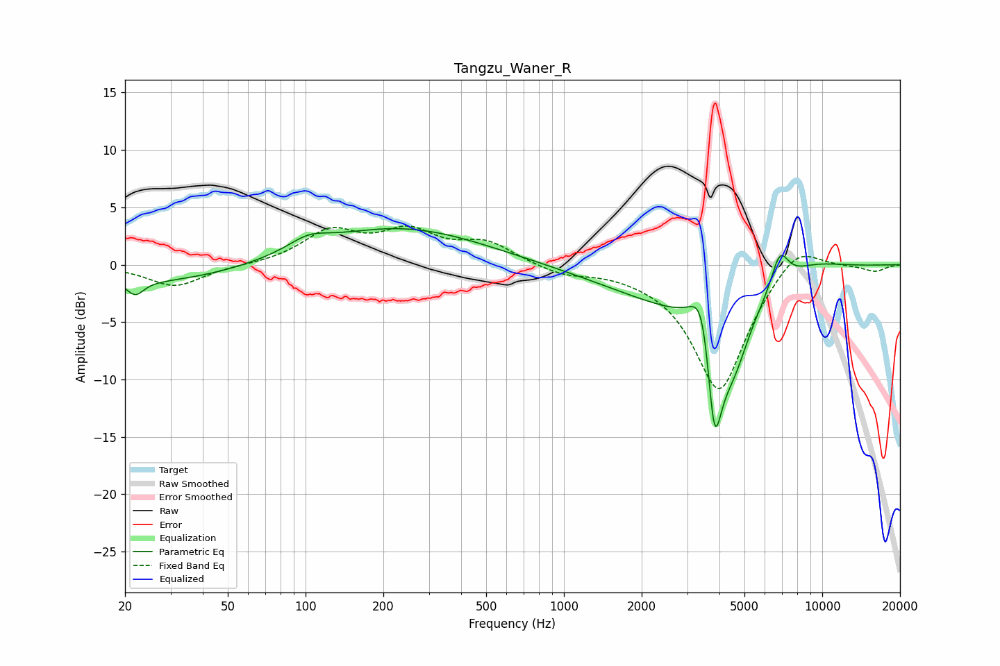

# Tangzu_Waner_R
See [usage instructions](https://github.com/jaakkopasanen/AutoEq#usage) for more options and info.

### Parametric EQs
Apply preamp of -3.2 dB when using parametric equalizer.

|   # | Type    |   Fc (Hz) |    Q |   Gain (dB) |
|-----|---------|-----------|------|-------------|
|   1 | Peaking |        22 | 4.35 |        -1.3 |
|   2 | Peaking |        27 | 0.45 |        -1.6 |
|   3 | Peaking |       103 | 1.83 |         1.1 |
|   4 | Peaking |       231 | 0.43 |         3.2 |
|   5 | Peaking |      3160 | 0.46 |        -3.6 |
|   6 | Peaking |      3467 | 3.23 |         6   |
|   7 | Peaking |      3820 | 4.39 |       -11.6 |
|   8 | Peaking |      4508 | 2.12 |        -5.3 |
|   9 | Peaking |      6851 | 4.05 |         3   |
|  10 | Peaking |      8772 | 0.95 |         1.3 |

### Fixed Band EQs
When using fixed band (also called graphic) equalizer, apply preamp of **-3.5 dB** (if available) and set gains manually with these parameters.

|   # | Type    |   Fc (Hz) |    Q |   Gain (dB) |
|-----|---------|-----------|------|-------------|
|   1 | Peaking |        31 | 1.41 |        -1.9 |
|   2 | Peaking |        62 | 1.41 |        -0   |
|   3 | Peaking |       125 | 1.41 |         2.8 |
|   4 | Peaking |       250 | 1.41 |         2.6 |
|   5 | Peaking |       500 | 1.41 |         1.8 |
|   6 | Peaking |      1000 | 1.41 |        -0.8 |
|   7 | Peaking |      2000 | 1.41 |        -0.2 |
|   8 | Peaking |      4000 | 1.41 |       -11.1 |
|   9 | Peaking |      8000 | 1.41 |         2.4 |
|  10 | Peaking |     16000 | 1.41 |        -0.6 |

### Graphs

