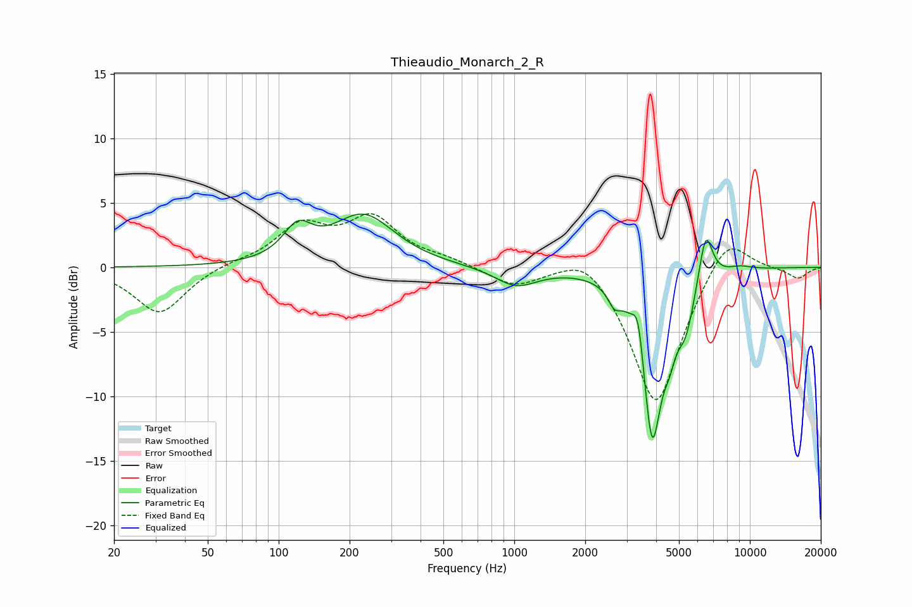

# Thieaudio_Monarch_2_R
See [usage instructions](https://github.com/jaakkopasanen/AutoEq#usage) for more options and info.

### Parametric EQs
Apply preamp of -4.2 dB when using parametric equalizer.

|   # | Type    |   Fc (Hz) |    Q |   Gain (dB) |
|-----|---------|-----------|------|-------------|
|   1 | Peaking |       120 | 2.35 |         2.4 |
|   2 | Peaking |       229 | 1.07 |         3.9 |
|   3 | Peaking |      1019 | 1.58 |        -1.5 |
|   4 | Peaking |      2659 | 5.28 |        -1.2 |
|   5 | Peaking |      3360 | 5.97 |         3.1 |
|   6 | Peaking |      3847 | 3.2  |       -13.2 |
|   7 | Peaking |      4557 | 5.55 |        -1.9 |
|   8 | Peaking |      5335 | 3.54 |        -3.3 |
|   9 | Peaking |      6492 | 4.7  |         4.1 |
|  10 | Peaking |      9042 | 2.44 |         0.4 |

### Fixed Band EQs
When using fixed band (also called graphic) equalizer, apply preamp of **-4.2 dB** (if available) and set gains manually with these parameters.

|   # | Type    |   Fc (Hz) |    Q |   Gain (dB) |
|-----|---------|-----------|------|-------------|
|   1 | Peaking |        31 | 1.41 |        -3.6 |
|   2 | Peaking |        62 | 1.41 |         0.3 |
|   3 | Peaking |       125 | 1.41 |         3   |
|   4 | Peaking |       250 | 1.41 |         3.6 |
|   5 | Peaking |       500 | 1.41 |         0.5 |
|   6 | Peaking |      1000 | 1.41 |        -1.4 |
|   7 | Peaking |      2000 | 1.41 |         1.8 |
|   8 | Peaking |      4000 | 1.41 |       -11   |
|   9 | Peaking |      8000 | 1.41 |         3.1 |
|  10 | Peaking |     16000 | 1.41 |        -0.9 |

### Graphs

