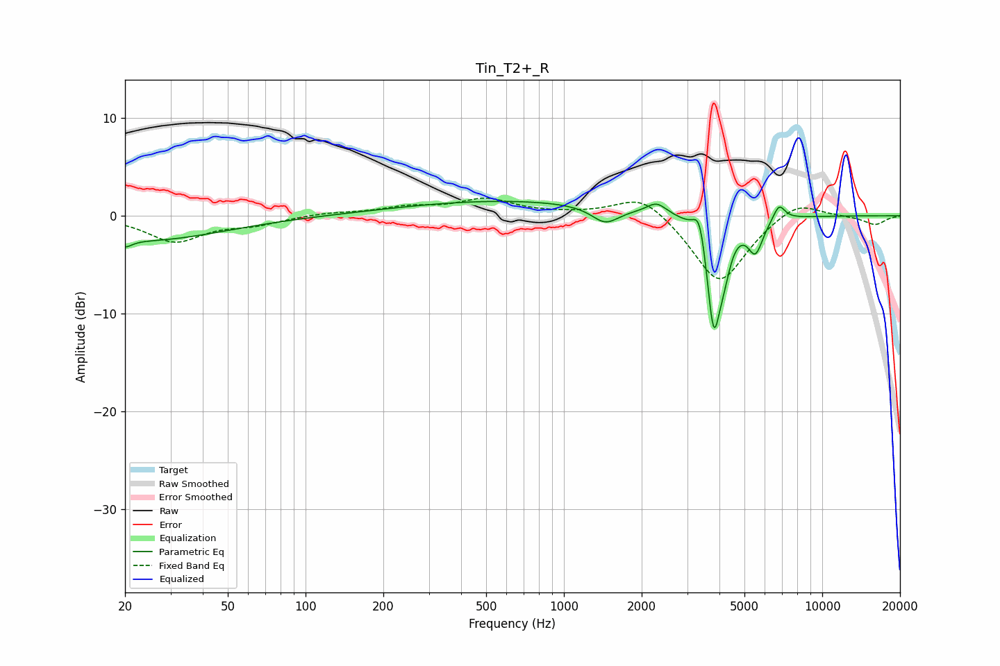

# Tin_T2+_R
See [usage instructions](https://github.com/jaakkopasanen/AutoEq#usage) for more options and info.

### Parametric EQs
Apply preamp of -1.6 dB when using parametric equalizer.

|   # | Type    |   Fc (Hz) |    Q |   Gain (dB) |
|-----|---------|-----------|------|-------------|
|   1 | Peaking |        20 | 5.31 |        -0.8 |
|   2 | Peaking |        24 | 0.47 |        -2.5 |
|   3 | Peaking |       606 | 0.34 |         1.5 |
|   4 | Peaking |      1446 | 2.71 |        -1.7 |
|   5 | Peaking |      2285 | 3.7  |         1.2 |
|   6 | Peaking |      3355 | 5.8  |         3.3 |
|   7 | Peaking |      3802 | 4.96 |       -11.6 |
|   8 | Peaking |      4182 | 5.8  |        -2.3 |
|   9 | Peaking |      5515 | 4.79 |        -3.3 |
|  10 | Peaking |      6807 | 5.97 |         1.6 |

### Fixed Band EQs
When using fixed band (also called graphic) equalizer, apply preamp of **-1.9 dB** (if available) and set gains manually with these parameters.

|   # | Type    |   Fc (Hz) |    Q |   Gain (dB) |
|-----|---------|-----------|------|-------------|
|   1 | Peaking |        31 | 1.41 |        -2.6 |
|   2 | Peaking |        62 | 1.41 |        -0.8 |
|   3 | Peaking |       125 | 1.41 |         0.3 |
|   4 | Peaking |       250 | 1.41 |         0.8 |
|   5 | Peaking |       500 | 1.41 |         1.6 |
|   6 | Peaking |      1000 | 1.41 |         0.1 |
|   7 | Peaking |      2000 | 1.41 |         2.4 |
|   8 | Peaking |      4000 | 1.41 |        -7.1 |
|   9 | Peaking |      8000 | 1.41 |         1.8 |
|  10 | Peaking |     16000 | 1.41 |        -0.9 |

### Graphs

