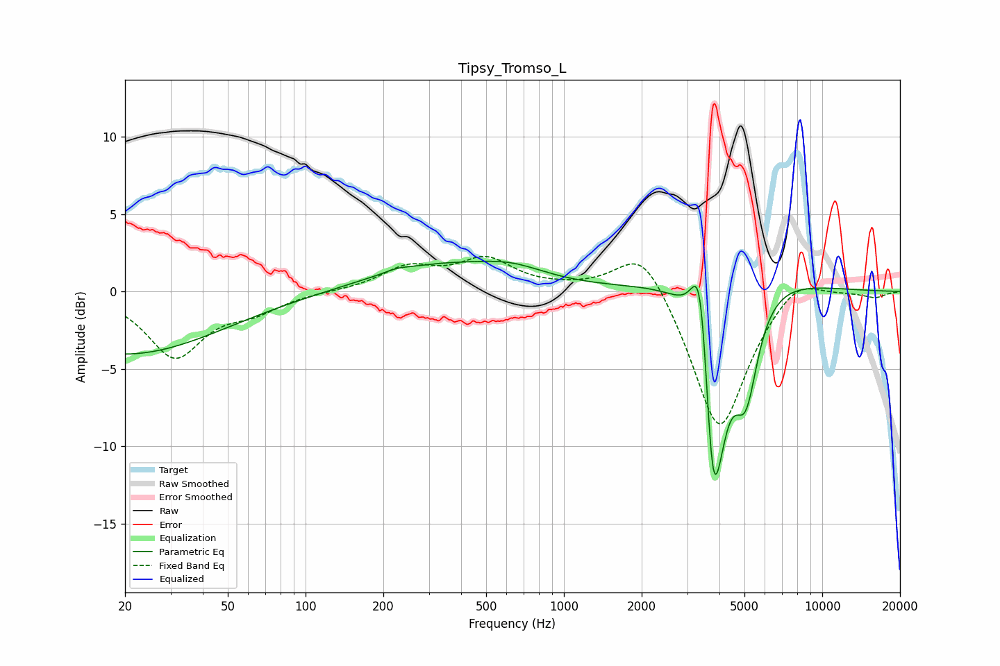

# Tipsy_Tromso_L
See [usage instructions](https://github.com/jaakkopasanen/AutoEq#usage) for more options and info.

### Parametric EQs
Apply preamp of -2.0 dB when using parametric equalizer.

|   # | Type    |   Fc (Hz) |    Q |   Gain (dB) |
|-----|---------|-----------|------|-------------|
|   1 | Peaking |        20 | 0.38 |        -4.1 |
|   2 | Peaking |       225 | 3.47 |         0.2 |
|   3 | Peaking |       310 | 0.56 |         1.6 |
|   4 | Peaking |       626 | 1.03 |         0.9 |
|   5 | Peaking |      3365 | 3.89 |         4.9 |
|   6 | Peaking |      3398 | 5.14 |         2.1 |
|   7 | Peaking |      3742 | 6    |        -4.3 |
|   8 | Peaking |      3866 | 2.62 |       -11.5 |
|   9 | Peaking |      4521 | 0.66 |         2.2 |
|  10 | Peaking |      5064 | 2.88 |        -6.4 |

### Fixed Band EQs
When using fixed band (also called graphic) equalizer, apply preamp of **-2.4 dB** (if available) and set gains manually with these parameters.

|   # | Type    |   Fc (Hz) |    Q |   Gain (dB) |
|-----|---------|-----------|------|-------------|
|   1 | Peaking |        31 | 1.41 |        -4.1 |
|   2 | Peaking |        62 | 1.41 |        -1   |
|   3 | Peaking |       125 | 1.41 |         0   |
|   4 | Peaking |       250 | 1.41 |         1.5 |
|   5 | Peaking |       500 | 1.41 |         2   |
|   6 | Peaking |      1000 | 1.41 |         0.1 |
|   7 | Peaking |      2000 | 1.41 |         3.2 |
|   8 | Peaking |      4000 | 1.41 |        -9.3 |
|   9 | Peaking |      8000 | 1.41 |         1.4 |
|  10 | Peaking |     16000 | 1.41 |        -0.4 |

### Graphs

