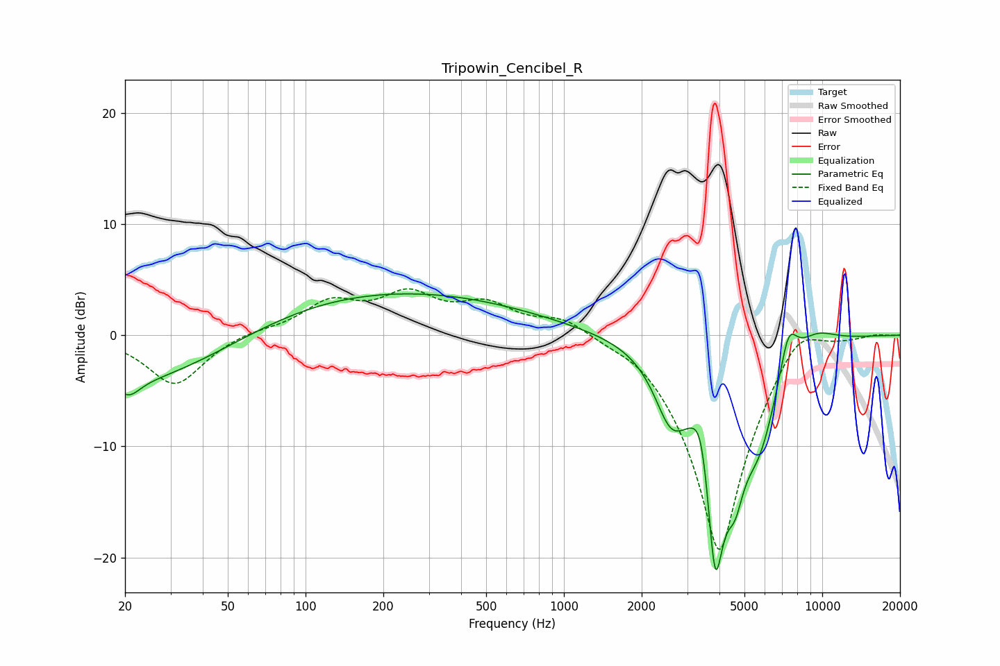

# Tripowin_Cencibel_R
See [usage instructions](https://github.com/jaakkopasanen/AutoEq#usage) for more options and info.

### Parametric EQs
Apply preamp of -3.8 dB when using parametric equalizer.

|   # | Type    |   Fc (Hz) |    Q |   Gain (dB) |
|-----|---------|-----------|------|-------------|
|   1 | Peaking |        20 | 0.33 |        -4.9 |
|   2 | Peaking |        21 | 3.46 |        -1.2 |
|   3 | Peaking |       193 | 0.24 |         4.1 |
|   4 | Peaking |      2586 | 2.26 |        -4.8 |
|   5 | Peaking |      3414 | 3.62 |         5.3 |
|   6 | Peaking |      3847 | 2.9  |       -20   |
|   7 | Peaking |      4596 | 4.24 |        -4.1 |
|   8 | Peaking |      5686 | 1.81 |        -7.1 |
|   9 | Peaking |      7400 | 3.89 |         3.9 |
|  10 | Peaking |      9372 | 1.57 |         1.5 |

### Fixed Band EQs
When using fixed band (also called graphic) equalizer, apply preamp of **-4.3 dB** (if available) and set gains manually with these parameters.

|   # | Type    |   Fc (Hz) |    Q |   Gain (dB) |
|-----|---------|-----------|------|-------------|
|   1 | Peaking |        31 | 1.41 |        -4.5 |
|   2 | Peaking |        62 | 1.41 |         0.4 |
|   3 | Peaking |       125 | 1.41 |         2.7 |
|   4 | Peaking |       250 | 1.41 |         3.2 |
|   5 | Peaking |       500 | 1.41 |         2.5 |
|   6 | Peaking |      1000 | 1.41 |         1.8 |
|   7 | Peaking |      2000 | 1.41 |         1   |
|   8 | Peaking |      4000 | 1.41 |       -20   |
|   9 | Peaking |      8000 | 1.41 |         3.2 |
|  10 | Peaking |     16000 | 1.41 |         0.2 |

### Graphs

