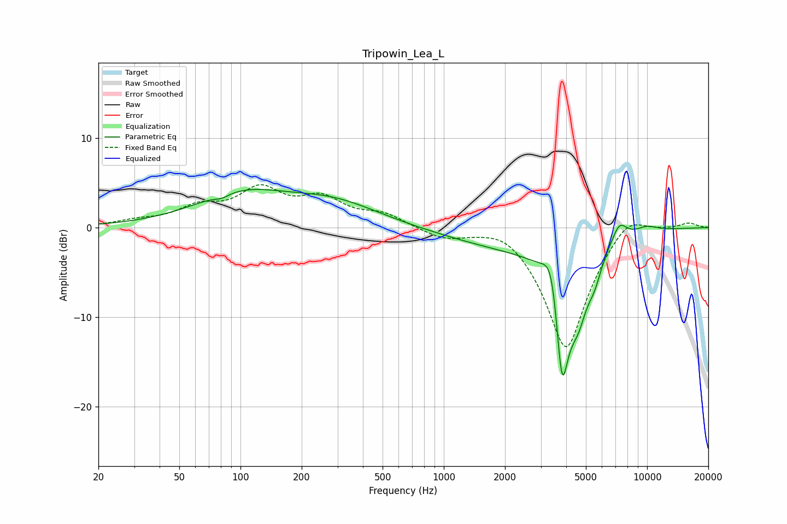

# Tripowin_Lea_L
See [usage instructions](https://github.com/jaakkopasanen/AutoEq#usage) for more options and info.

### Parametric EQs
Apply preamp of -4.3 dB when using parametric equalizer.

|   # | Type    |   Fc (Hz) |    Q |   Gain (dB) |
|-----|---------|-----------|------|-------------|
|   1 | Peaking |        81 | 4.15 |        -0.4 |
|   2 | Peaking |       101 | 0.61 |         3.5 |
|   3 | Peaking |       289 | 0.62 |         2.5 |
|   4 | Peaking |      2298 | 0.44 |        -2.2 |
|   5 | Peaking |      3412 | 3.39 |         5.7 |
|   6 | Peaking |      3812 | 3.55 |       -15.8 |
|   7 | Peaking |      4584 | 2.99 |        -5.1 |
|   8 | Peaking |      5506 | 3.86 |        -2.3 |
|   9 | Peaking |      7301 | 3.64 |         2.1 |
|  10 | Peaking |      9952 | 2.18 |         0.7 |

### Fixed Band EQs
When using fixed band (also called graphic) equalizer, apply preamp of **-4.9 dB** (if available) and set gains manually with these parameters.

|   # | Type    |   Fc (Hz) |    Q |   Gain (dB) |
|-----|---------|-----------|------|-------------|
|   1 | Peaking |        31 | 1.41 |         0.6 |
|   2 | Peaking |        62 | 1.41 |         1.9 |
|   3 | Peaking |       125 | 1.41 |         3.9 |
|   4 | Peaking |       250 | 1.41 |         2.8 |
|   5 | Peaking |       500 | 1.41 |         1.4 |
|   6 | Peaking |      1000 | 1.41 |        -1.1 |
|   7 | Peaking |      2000 | 1.41 |         1.2 |
|   8 | Peaking |      4000 | 1.41 |       -13.8 |
|   9 | Peaking |      8000 | 1.41 |         2.4 |
|  10 | Peaking |     16000 | 1.41 |         0.6 |

### Graphs

