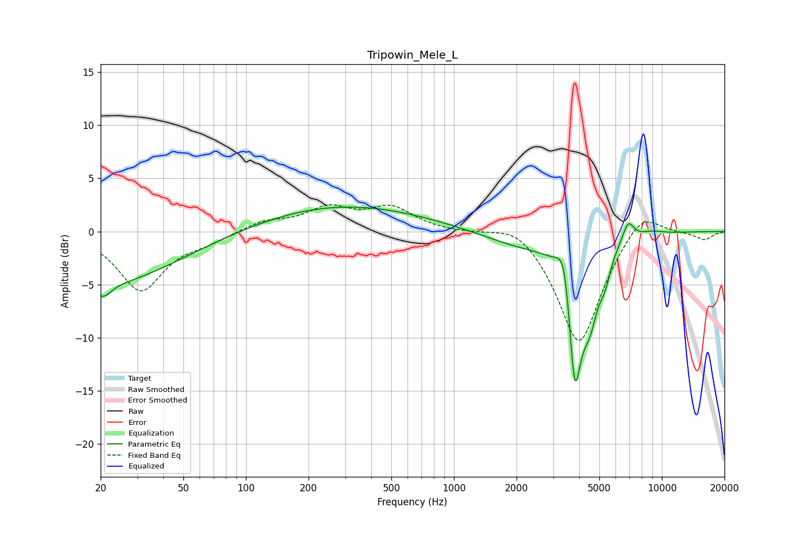

# Tripowin_Mele_L
See [usage instructions](https://github.com/jaakkopasanen/AutoEq#usage) for more options and info.

### Parametric EQs
Apply preamp of -2.4 dB when using parametric equalizer.

|   # | Type    |   Fc (Hz) |    Q |   Gain (dB) |
|-----|---------|-----------|------|-------------|
|   1 | Peaking |        20 | 0.39 |        -5   |
|   2 | Peaking |        21 | 3.93 |        -1.2 |
|   3 | Peaking |       294 | 0.35 |         2.5 |
|   4 | Peaking |      2105 | 0.75 |        -1.3 |
|   5 | Peaking |      3410 | 4.08 |         4.7 |
|   6 | Peaking |      3807 | 4.03 |       -13.8 |
|   7 | Peaking |      4511 | 3.47 |        -5   |
|   8 | Peaking |      5321 | 5.04 |        -2.1 |
|   9 | Peaking |      6884 | 5.04 |         1.9 |
|  10 | Peaking |      8853 | 2.26 |         0.3 |

### Fixed Band EQs
When using fixed band (also called graphic) equalizer, apply preamp of **-2.6 dB** (if available) and set gains manually with these parameters.

|   # | Type    |   Fc (Hz) |    Q |   Gain (dB) |
|-----|---------|-----------|------|-------------|
|   1 | Peaking |        31 | 1.41 |        -5.5 |
|   2 | Peaking |        62 | 1.41 |        -0.8 |
|   3 | Peaking |       125 | 1.41 |         0.9 |
|   4 | Peaking |       250 | 1.41 |         2   |
|   5 | Peaking |       500 | 1.41 |         2.1 |
|   6 | Peaking |      1000 | 1.41 |        -0   |
|   7 | Peaking |      2000 | 1.41 |         1.3 |
|   8 | Peaking |      4000 | 1.41 |       -10.8 |
|   9 | Peaking |      8000 | 1.41 |         2.5 |
|  10 | Peaking |     16000 | 1.41 |        -0.8 |

### Graphs

