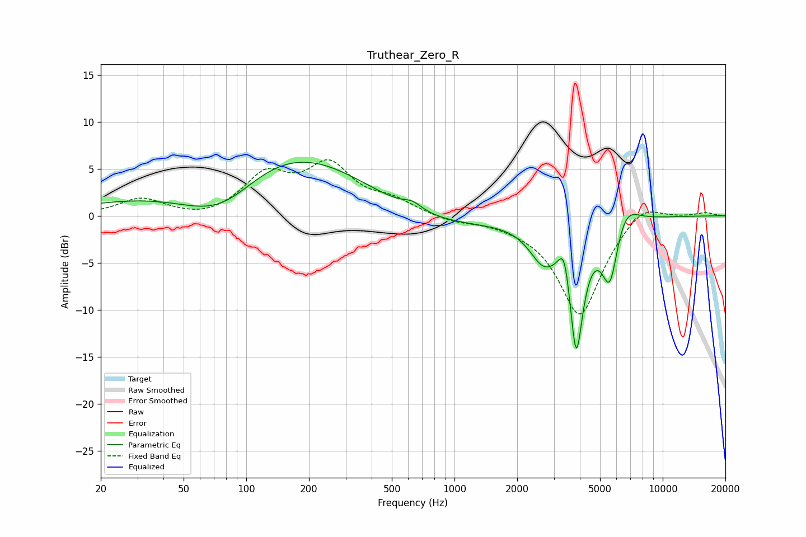

# Truthear_Zero_R
See [usage instructions](https://github.com/jaakkopasanen/AutoEq#usage) for more options and info.

### Parametric EQs
Apply preamp of -5.8 dB when using parametric equalizer.

|   # | Type    |   Fc (Hz) |    Q |   Gain (dB) |
|-----|---------|-----------|------|-------------|
|   1 | Peaking |        77 | 0.53 |       -10   |
|   2 | Peaking |       115 | 0.3  |        12.6 |
|   3 | Peaking |       623 | 0.44 |        -2.5 |
|   4 | Peaking |       629 | 3.16 |         0.8 |
|   5 | Peaking |      2683 | 2.01 |        -3.8 |
|   6 | Peaking |      3369 | 5.46 |         3.5 |
|   7 | Peaking |      3843 | 4.03 |       -13.5 |
|   8 | Peaking |      5328 | 3.2  |        -0.9 |
|   9 | Peaking |      5590 | 3.9  |        -5.5 |
|  10 | Peaking |      6648 | 2.4  |         2.2 |

### Fixed Band EQs
When using fixed band (also called graphic) equalizer, apply preamp of **-6.1 dB** (if available) and set gains manually with these parameters.

|   # | Type    |   Fc (Hz) |    Q |   Gain (dB) |
|-----|---------|-----------|------|-------------|
|   1 | Peaking |        31 | 1.41 |         1.8 |
|   2 | Peaking |        62 | 1.41 |        -0.5 |
|   3 | Peaking |       125 | 1.41 |         4.1 |
|   4 | Peaking |       250 | 1.41 |         5   |
|   5 | Peaking |       500 | 1.41 |         1.4 |
|   6 | Peaking |      1000 | 1.41 |        -0.6 |
|   7 | Peaking |      2000 | 1.41 |        -0.4 |
|   8 | Peaking |      4000 | 1.41 |       -10.7 |
|   9 | Peaking |      8000 | 1.41 |         1.9 |
|  10 | Peaking |     16000 | 1.41 |         0.4 |

### Graphs

