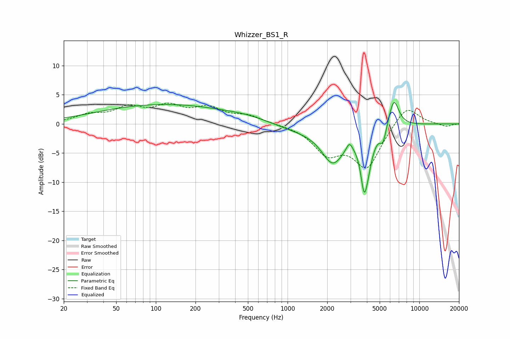

# Whizzer_BS1_R
See [usage instructions](https://github.com/jaakkopasanen/AutoEq#usage) for more options and info.

### Parametric EQs
Apply preamp of -3.8 dB when using parametric equalizer.

|   # | Type    |   Fc (Hz) |    Q |   Gain (dB) |
|-----|---------|-----------|------|-------------|
|   1 | Peaking |       116 | 0.27 |         3.3 |
|   2 | Peaking |       491 | 1.03 |         0.4 |
|   3 | Peaking |      1160 | 0.82 |        -0.9 |
|   4 | Peaking |      2203 | 1.62 |        -6.1 |
|   5 | Peaking |      2947 | 6    |         1.5 |
|   6 | Peaking |      3602 | 3.46 |         2.4 |
|   7 | Peaking |      3813 | 3.82 |       -12.1 |
|   8 | Peaking |      4138 | 5.35 |        -1.1 |
|   9 | Peaking |      5308 | 6    |        -2.5 |
|  10 | Peaking |      6402 | 3.58 |         4.9 |

### Fixed Band EQs
When using fixed band (also called graphic) equalizer, apply preamp of **-3.7 dB** (if available) and set gains manually with these parameters.

|   # | Type    |   Fc (Hz) |    Q |   Gain (dB) |
|-----|---------|-----------|------|-------------|
|   1 | Peaking |        31 | 1.41 |         1.3 |
|   2 | Peaking |        62 | 1.41 |         2.5 |
|   3 | Peaking |       125 | 1.41 |         2.6 |
|   4 | Peaking |       250 | 1.41 |         2.4 |
|   5 | Peaking |       500 | 1.41 |         1.3 |
|   6 | Peaking |      1000 | 1.41 |        -0.1 |
|   7 | Peaking |      2000 | 1.41 |        -4.6 |
|   8 | Peaking |      4000 | 1.41 |        -7.2 |
|   9 | Peaking |      8000 | 1.41 |         3.5 |
|  10 | Peaking |     16000 | 1.41 |        -0.5 |

### Graphs

