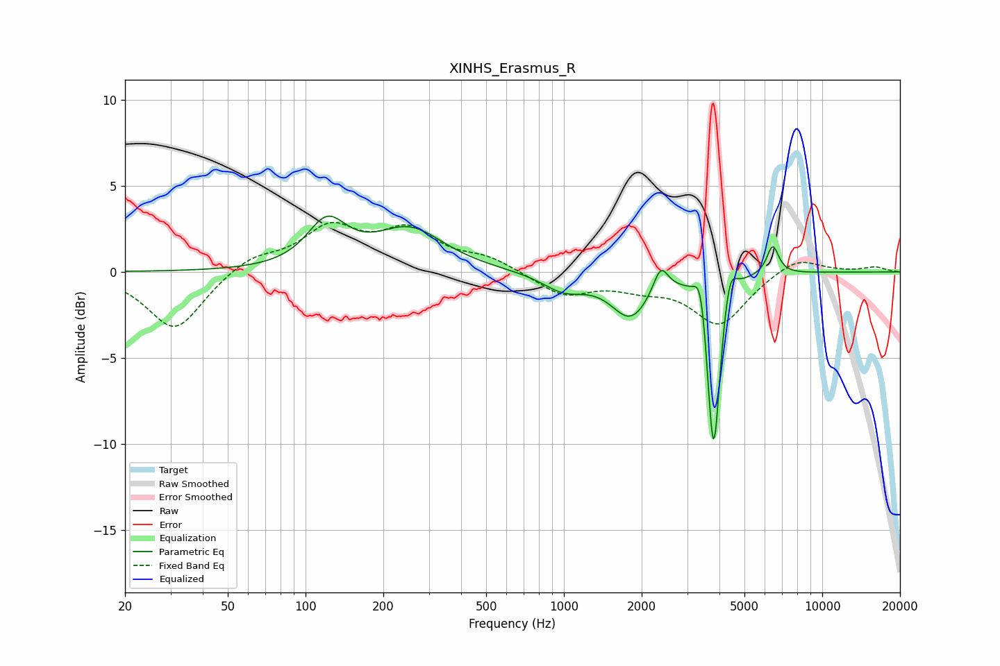

# XINHS_Erasmus_R
See [usage instructions](https://github.com/jaakkopasanen/AutoEq#usage) for more options and info.

### Parametric EQs
Apply preamp of -3.3 dB when using parametric equalizer.

|   # | Type    |   Fc (Hz) |    Q |   Gain (dB) |
|-----|---------|-----------|------|-------------|
|   1 | Peaking |       121 | 1.87 |         2.6 |
|   2 | Peaking |       253 | 1.07 |         2.4 |
|   3 | Peaking |      1000 | 1.67 |        -1   |
|   4 | Peaking |      1812 | 1.9  |        -2.5 |
|   5 | Peaking |      2369 | 5.1  |         1.5 |
|   6 | Peaking |      3389 | 6    |         2.2 |
|   7 | Peaking |      3752 | 5.99 |        -1.6 |
|   8 | Peaking |      3803 | 5.88 |        -9.3 |
|   9 | Peaking |      4388 | 6    |         1.7 |
|  10 | Peaking |      6433 | 6    |         1.7 |

### Fixed Band EQs
When using fixed band (also called graphic) equalizer, apply preamp of **-3.0 dB** (if available) and set gains manually with these parameters.

|   # | Type    |   Fc (Hz) |    Q |   Gain (dB) |
|-----|---------|-----------|------|-------------|
|   1 | Peaking |        31 | 1.41 |        -3.4 |
|   2 | Peaking |        62 | 1.41 |         0.9 |
|   3 | Peaking |       125 | 1.41 |         2.4 |
|   4 | Peaking |       250 | 1.41 |         2.2 |
|   5 | Peaking |       500 | 1.41 |         0.7 |
|   6 | Peaking |      1000 | 1.41 |        -1.3 |
|   7 | Peaking |      2000 | 1.41 |        -0.7 |
|   8 | Peaking |      4000 | 1.41 |        -3   |
|   9 | Peaking |      8000 | 1.41 |         1   |
|  10 | Peaking |     16000 | 1.41 |         0.3 |

### Graphs

