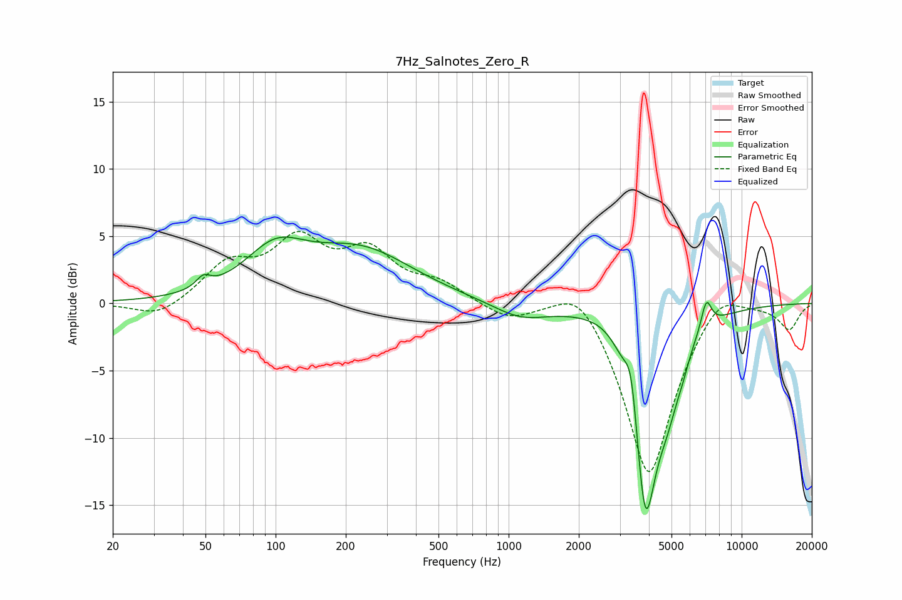

# 7Hz_Salnotes_Zero_R
See [usage instructions](https://github.com/jaakkopasanen/AutoEq#usage) for more options and info.

### Parametric EQs
Apply preamp of -5.0 dB when using parametric equalizer.

|   # | Type    |   Fc (Hz) |    Q |   Gain (dB) |
|-----|---------|-----------|------|-------------|
|   1 | Peaking |        49 | 4.68 |         0.8 |
|   2 | Peaking |       100 | 1.07 |         3.3 |
|   3 | Peaking |       233 | 0.63 |         3.7 |
|   4 | Peaking |      1126 | 1.19 |        -1.2 |
|   5 | Peaking |      2862 | 1.34 |         1.7 |
|   6 | Peaking |      3364 | 5.2  |         3.7 |
|   7 | Peaking |      3857 | 2.42 |       -16   |
|   8 | Peaking |      4825 | 2.64 |        -3.2 |
|   9 | Peaking |      5584 | 5.09 |        -0.7 |
|  10 | Peaking |      7052 | 6    |         2.2 |

### Fixed Band EQs
When using fixed band (also called graphic) equalizer, apply preamp of **-5.4 dB** (if available) and set gains manually with these parameters.

|   # | Type    |   Fc (Hz) |    Q |   Gain (dB) |
|-----|---------|-----------|------|-------------|
|   1 | Peaking |        31 | 1.41 |        -1.2 |
|   2 | Peaking |        62 | 1.41 |         2.7 |
|   3 | Peaking |       125 | 1.41 |         4.2 |
|   4 | Peaking |       250 | 1.41 |         3.4 |
|   5 | Peaking |       500 | 1.41 |         1.3 |
|   6 | Peaking |      1000 | 1.41 |        -1.2 |
|   7 | Peaking |      2000 | 1.41 |         2.4 |
|   8 | Peaking |      4000 | 1.41 |       -13.2 |
|   9 | Peaking |      8000 | 1.41 |         1.9 |
|  10 | Peaking |     16000 | 1.41 |        -1.9 |

### Graphs

