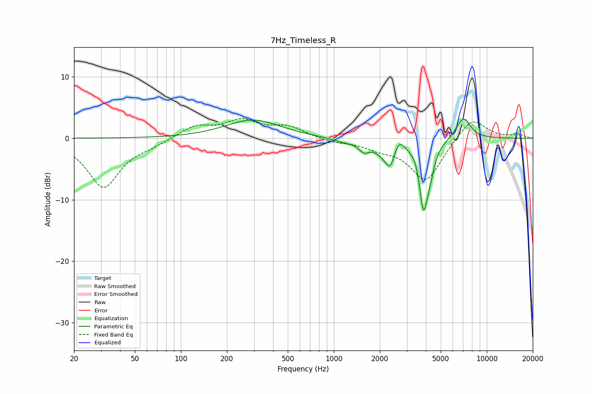

# 7Hz_Timeless_R
See [usage instructions](https://github.com/jaakkopasanen/AutoEq#usage) for more options and info.

### Parametric EQs
Apply preamp of -3.2 dB when using parametric equalizer.

|   # | Type    |   Fc (Hz) |    Q |   Gain (dB) |
|-----|---------|-----------|------|-------------|
|   1 | Peaking |       295 | 0.8  |         3   |
|   2 | Peaking |      1160 | 1.83 |        -0.5 |
|   3 | Peaking |      1575 | 4.49 |        -1.3 |
|   4 | Peaking |      2338 | 2.09 |        -4   |
|   5 | Peaking |      2340 | 6    |        -1.6 |
|   6 | Peaking |      2654 | 3.5  |         3.3 |
|   7 | Peaking |      3460 | 5.19 |         1.3 |
|   8 | Peaking |      3864 | 4.38 |       -11.5 |
|   9 | Peaking |      4297 | 6    |        -1.8 |
|  10 | Peaking |      7038 | 2.82 |         3.5 |

### Fixed Band EQs
When using fixed band (also called graphic) equalizer, apply preamp of **-3.3 dB** (if available) and set gains manually with these parameters.

|   # | Type    |   Fc (Hz) |    Q |   Gain (dB) |
|-----|---------|-----------|------|-------------|
|   1 | Peaking |        31 | 1.41 |        -7.9 |
|   2 | Peaking |        62 | 1.41 |        -0.8 |
|   3 | Peaking |       125 | 1.41 |         2   |
|   4 | Peaking |       250 | 1.41 |         2.7 |
|   5 | Peaking |       500 | 1.41 |         1.8 |
|   6 | Peaking |      1000 | 1.41 |        -0.6 |
|   7 | Peaking |      2000 | 1.41 |        -1.3 |
|   8 | Peaking |      4000 | 1.41 |        -7   |
|   9 | Peaking |      8000 | 1.41 |         3.6 |
|  10 | Peaking |     16000 | 1.41 |         0.6 |

### Graphs

