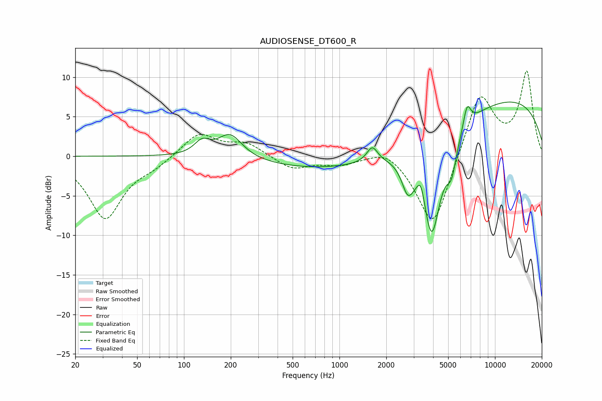

# AUDIOSENSE_DT600_R
See [usage instructions](https://github.com/jaakkopasanen/AutoEq#usage) for more options and info.

### Parametric EQs
Apply preamp of -6.9 dB when using parametric equalizer.

|   # | Type    |   Fc (Hz) |    Q |   Gain (dB) |
|-----|---------|-----------|------|-------------|
|   1 | Peaking |       131 | 2.84 |         1.6 |
|   2 | Peaking |       198 | 1.81 |         3   |
|   3 | Peaking |      1626 | 4.1  |         1.9 |
|   4 | Peaking |      1735 | 0.18 |        -2.1 |
|   5 | Peaking |      2753 | 3.62 |        -3.7 |
|   6 | Peaking |      3339 | 6    |         2.4 |
|   7 | Peaking |      3920 | 2.26 |       -12.9 |
|   8 | Peaking |      5263 | 4.35 |        -3.6 |
|   9 | Peaking |      6617 | 5.76 |         2.8 |
|  10 | Peaking |     10000 | 0.22 |         7.8 |

### Fixed Band EQs
When using fixed band (also called graphic) equalizer, apply preamp of **-10.9 dB** (if available) and set gains manually with these parameters.

|   # | Type    |   Fc (Hz) |    Q |   Gain (dB) |
|-----|---------|-----------|------|-------------|
|   1 | Peaking |        31 | 1.41 |        -7.8 |
|   2 | Peaking |        62 | 1.41 |        -1   |
|   3 | Peaking |       125 | 1.41 |         3   |
|   4 | Peaking |       250 | 1.41 |         1.6 |
|   5 | Peaking |       500 | 1.41 |        -1.6 |
|   6 | Peaking |      1000 | 1.41 |        -0.9 |
|   7 | Peaking |      2000 | 1.41 |         1.4 |
|   8 | Peaking |      4000 | 1.41 |        -9.5 |
|   9 | Peaking |      8000 | 1.41 |         8.3 |
|  10 | Peaking |     16000 | 1.41 |        10.5 |

### Graphs

