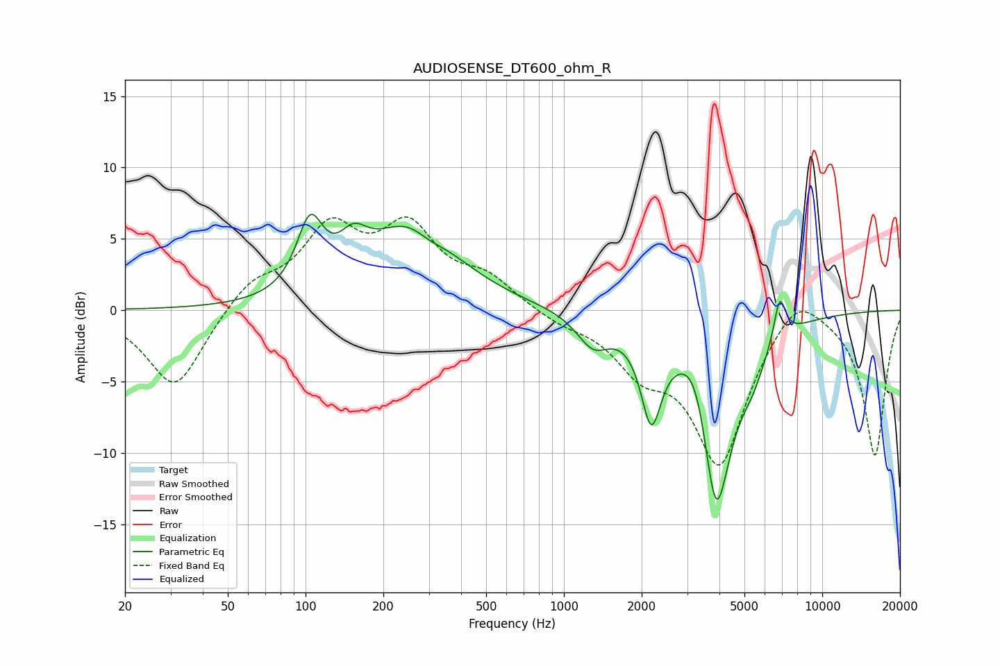

# AUDIOSENSE_DT600_ohm_R
See [usage instructions](https://github.com/jaakkopasanen/AutoEq#usage) for more options and info.

### Parametric EQs
Apply preamp of -6.8 dB when using parametric equalizer.

|   # | Type    |   Fc (Hz) |    Q |   Gain (dB) |
|-----|---------|-----------|------|-------------|
|   1 | Peaking |       104 | 2.8  |         4.8 |
|   2 | Peaking |       153 | 2.59 |         2.2 |
|   3 | Peaking |       262 | 0.84 |         6.1 |
|   4 | Peaking |       299 | 2.07 |        -1   |
|   5 | Peaking |      1298 | 2.23 |        -2.2 |
|   6 | Peaking |      2179 | 3.55 |        -6.2 |
|   7 | Peaking |      3280 | 2.38 |         3.6 |
|   8 | Peaking |      3877 | 2.12 |       -14.7 |
|   9 | Peaking |      5355 | 2.72 |        -1.7 |
|  10 | Peaking |      6843 | 6    |         3.1 |

### Fixed Band EQs
When using fixed band (also called graphic) equalizer, apply preamp of **-6.6 dB** (if available) and set gains manually with these parameters.

|   # | Type    |   Fc (Hz) |    Q |   Gain (dB) |
|-----|---------|-----------|------|-------------|
|   1 | Peaking |        31 | 1.41 |        -5.6 |
|   2 | Peaking |        62 | 1.41 |         1.9 |
|   3 | Peaking |       125 | 1.41 |         5.3 |
|   4 | Peaking |       250 | 1.41 |         5.2 |
|   5 | Peaking |       500 | 1.41 |         2   |
|   6 | Peaking |      1000 | 1.41 |        -0.7 |
|   7 | Peaking |      2000 | 1.41 |        -3.3 |
|   8 | Peaking |      4000 | 1.41 |       -10.5 |
|   9 | Peaking |      8000 | 1.41 |         2.2 |
|  10 | Peaking |     16000 | 1.41 |       -10.2 |

### Graphs

