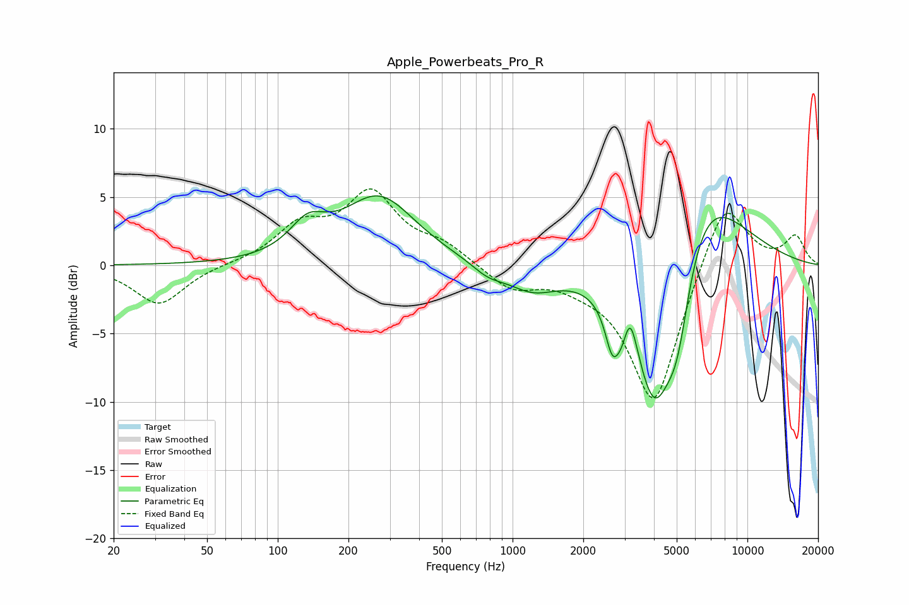

# Apple_Powerbeats_Pro_R
See [usage instructions](https://github.com/jaakkopasanen/AutoEq#usage) for more options and info.

### Parametric EQs
Apply preamp of -5.2 dB when using parametric equalizer.

|   # | Type    |   Fc (Hz) |    Q |   Gain (dB) |
|-----|---------|-----------|------|-------------|
|   1 | Peaking |       134 | 1.86 |         2.1 |
|   2 | Peaking |       270 | 0.91 |         4.9 |
|   3 | Peaking |       785 | 2.04 |        -0.8 |
|   4 | Peaking |      1213 | 1.3  |        -1.7 |
|   5 | Peaking |      2663 | 4.6  |        -3.2 |
|   6 | Peaking |      2910 | 5.99 |        -1   |
|   7 | Peaking |      3175 | 5.18 |         2.5 |
|   8 | Peaking |      4024 | 1.39 |       -12.5 |
|   9 | Peaking |      5033 | 2.58 |        -5.3 |
|  10 | Peaking |      6210 | 0.78 |         7.9 |

### Fixed Band EQs
When using fixed band (also called graphic) equalizer, apply preamp of **-5.7 dB** (if available) and set gains manually with these parameters.

|   # | Type    |   Fc (Hz) |    Q |   Gain (dB) |
|-----|---------|-----------|------|-------------|
|   1 | Peaking |        31 | 1.41 |        -2.9 |
|   2 | Peaking |        62 | 1.41 |         0.1 |
|   3 | Peaking |       125 | 1.41 |         2.6 |
|   4 | Peaking |       250 | 1.41 |         5   |
|   5 | Peaking |       500 | 1.41 |         1.3 |
|   6 | Peaking |      1000 | 1.41 |        -1.7 |
|   7 | Peaking |      2000 | 1.41 |        -0.7 |
|   8 | Peaking |      4000 | 1.41 |       -10.4 |
|   9 | Peaking |      8000 | 1.41 |         5.3 |
|  10 | Peaking |     16000 | 1.41 |         2.1 |

### Graphs

