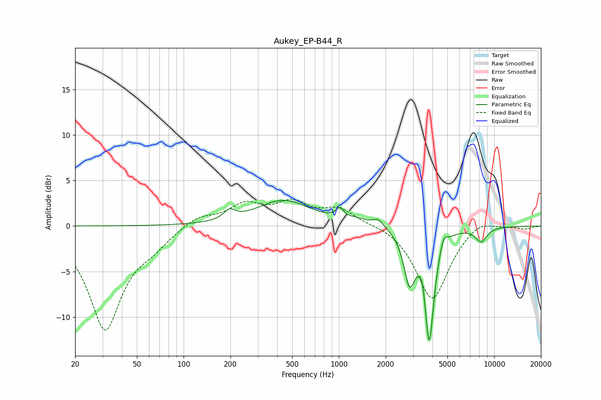

# Aukey_EP-B44_R
See [usage instructions](https://github.com/jaakkopasanen/AutoEq#usage) for more options and info.

### Parametric EQs
Apply preamp of -2.9 dB when using parametric equalizer.

|   # | Type    |   Fc (Hz) |    Q |   Gain (dB) |
|-----|---------|-----------|------|-------------|
|   1 | Peaking |       198 | 3.99 |         1   |
|   2 | Peaking |       441 | 0.82 |         2.8 |
|   3 | Peaking |      1013 | 6    |         1.1 |
|   4 | Peaking |      1299 | 2.18 |         0.5 |
|   5 | Peaking |      1794 | 3.96 |         0.9 |
|   6 | Peaking |      2850 | 3.89 |        -5.4 |
|   7 | Peaking |      3470 | 6    |         1.5 |
|   8 | Peaking |      3814 | 4.6  |       -12.7 |
|   9 | Peaking |      4714 | 6    |         1.4 |
|  10 | Peaking |      8242 | 3.53 |        -1.5 |

### Fixed Band EQs
When using fixed band (also called graphic) equalizer, apply preamp of **-3.0 dB** (if available) and set gains manually with these parameters.

|   # | Type    |   Fc (Hz) |    Q |   Gain (dB) |
|-----|---------|-----------|------|-------------|
|   1 | Peaking |        31 | 1.41 |       -11.2 |
|   2 | Peaking |        62 | 1.41 |        -1.4 |
|   3 | Peaking |       125 | 1.41 |         1.2 |
|   4 | Peaking |       250 | 1.41 |         2.2 |
|   5 | Peaking |       500 | 1.41 |         2.3 |
|   6 | Peaking |      1000 | 1.41 |         1.8 |
|   7 | Peaking |      2000 | 1.41 |         0.3 |
|   8 | Peaking |      4000 | 1.41 |        -8.2 |
|   9 | Peaking |      8000 | 1.41 |         1   |
|  10 | Peaking |     16000 | 1.41 |        -0.3 |

### Graphs

