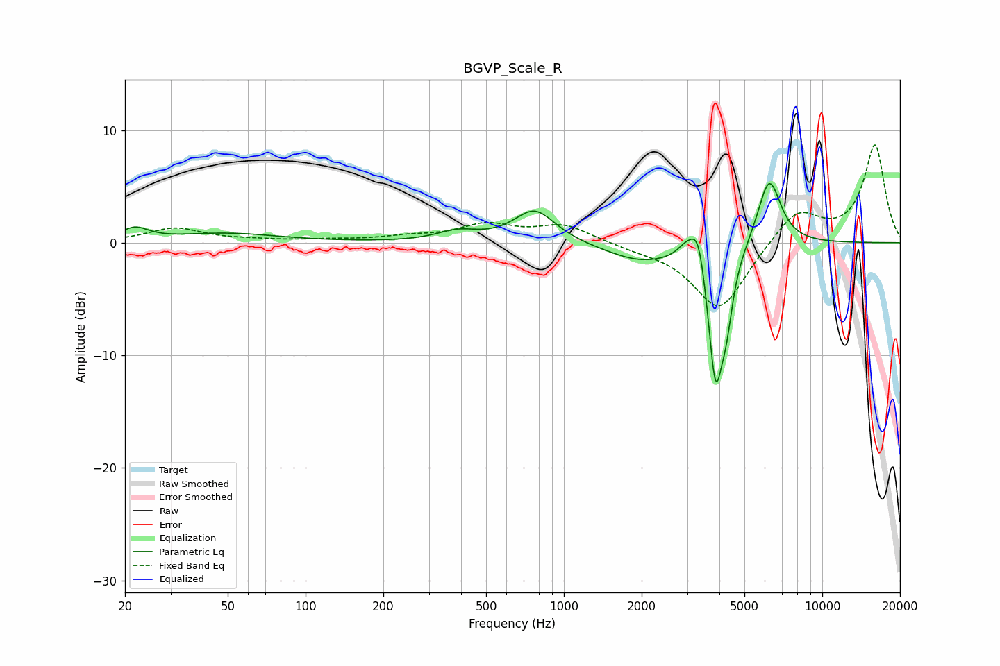

# BGVP_Scale_R
See [usage instructions](https://github.com/jaakkopasanen/AutoEq#usage) for more options and info.

### Parametric EQs
Apply preamp of -5.4 dB when using parametric equalizer.

|   # | Type    |   Fc (Hz) |    Q |   Gain (dB) |
|-----|---------|-----------|------|-------------|
|   1 | Peaking |        22 | 2.78 |         1.1 |
|   2 | Peaking |        49 | 0.7  |         0.8 |
|   3 | Peaking |       388 | 1.79 |         0.9 |
|   4 | Peaking |       771 | 1.78 |         2.9 |
|   5 | Peaking |      1991 | 1.05 |        -1.6 |
|   6 | Peaking |      2958 | 4.27 |         1   |
|   7 | Peaking |      3317 | 4.56 |         4.1 |
|   8 | Peaking |      3865 | 4.46 |       -12.5 |
|   9 | Peaking |      4264 | 5.96 |        -3.5 |
|  10 | Peaking |      6233 | 3.04 |         6.1 |

### Fixed Band EQs
When using fixed band (also called graphic) equalizer, apply preamp of **-8.8 dB** (if available) and set gains manually with these parameters.

|   # | Type    |   Fc (Hz) |    Q |   Gain (dB) |
|-----|---------|-----------|------|-------------|
|   1 | Peaking |        31 | 1.41 |         1.3 |
|   2 | Peaking |        62 | 1.41 |         0.2 |
|   3 | Peaking |       125 | 1.41 |         0.2 |
|   4 | Peaking |       250 | 1.41 |         0.4 |
|   5 | Peaking |       500 | 1.41 |         1.5 |
|   6 | Peaking |      1000 | 1.41 |         1.5 |
|   7 | Peaking |      2000 | 1.41 |        -0.4 |
|   8 | Peaking |      4000 | 1.41 |        -6.1 |
|   9 | Peaking |      8000 | 1.41 |         3   |
|  10 | Peaking |     16000 | 1.41 |         8.6 |

### Graphs

