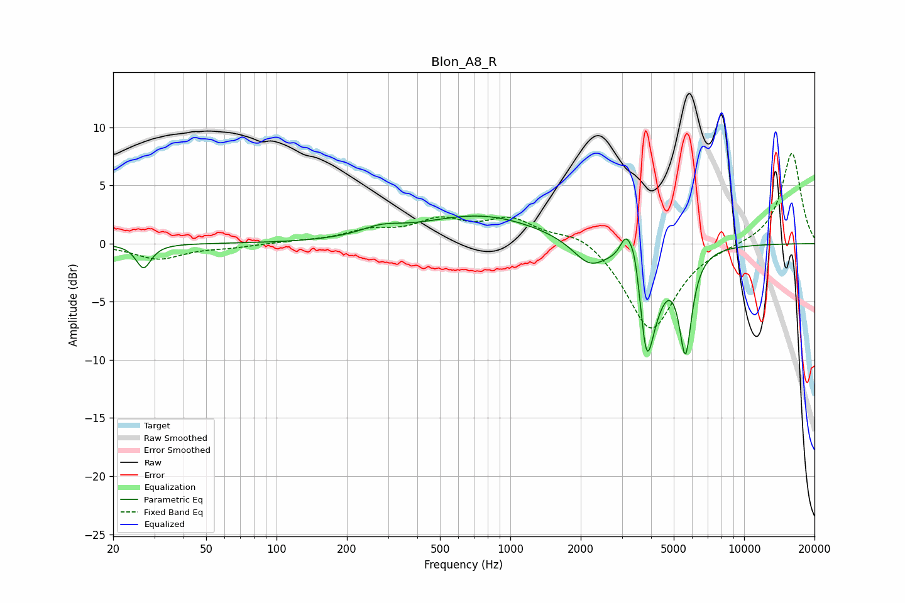

# Blon_A8_R
See [usage instructions](https://github.com/jaakkopasanen/AutoEq#usage) for more options and info.

### Parametric EQs
Apply preamp of -2.5 dB when using parametric equalizer.

|   # | Type    |   Fc (Hz) |    Q |   Gain (dB) |
|-----|---------|-----------|------|-------------|
|   1 | Peaking |        27 | 4.57 |        -2.1 |
|   2 | Peaking |       280 | 1.6  |         0.7 |
|   3 | Peaking |       750 | 0.55 |         2.4 |
|   4 | Peaking |      2181 | 1.98 |        -2.1 |
|   5 | Peaking |      3118 | 5.52 |         2.1 |
|   6 | Peaking |      3415 | 5.29 |         3.1 |
|   7 | Peaking |      3798 | 5.99 |        -3   |
|   8 | Peaking |      3935 | 3.26 |        -8.9 |
|   9 | Peaking |      4035 | 5.37 |         1.8 |
|  10 | Peaking |      5611 | 5.18 |        -8.4 |

### Fixed Band EQs
When using fixed band (also called graphic) equalizer, apply preamp of **-7.9 dB** (if available) and set gains manually with these parameters.

|   # | Type    |   Fc (Hz) |    Q |   Gain (dB) |
|-----|---------|-----------|------|-------------|
|   1 | Peaking |        31 | 1.41 |        -1.3 |
|   2 | Peaking |        62 | 1.41 |        -0.3 |
|   3 | Peaking |       125 | 1.41 |         0.1 |
|   4 | Peaking |       250 | 1.41 |         1   |
|   5 | Peaking |       500 | 1.41 |         1.8 |
|   6 | Peaking |      1000 | 1.41 |         2   |
|   7 | Peaking |      2000 | 1.41 |         1.2 |
|   8 | Peaking |      4000 | 1.41 |        -7.6 |
|   9 | Peaking |      8000 | 1.41 |        -0.1 |
|  10 | Peaking |     16000 | 1.41 |         7.9 |

### Graphs

