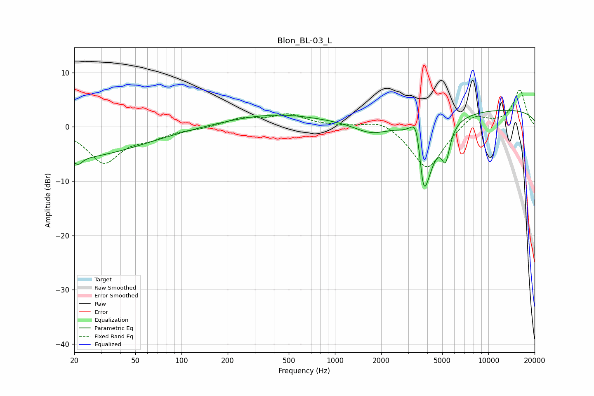

# Blon_BL-03_L
See [usage instructions](https://github.com/jaakkopasanen/AutoEq#usage) for more options and info.

### Parametric EQs
Apply preamp of -3.1 dB when using parametric equalizer.

|   # | Type    |   Fc (Hz) |    Q |   Gain (dB) |
|-----|---------|-----------|------|-------------|
|   1 | Peaking |        20 | 0.33 |        -5.6 |
|   2 | Peaking |        21 | 5.23 |        -1.4 |
|   3 | Peaking |       406 | 0.45 |         2.3 |
|   4 | Peaking |      1734 | 1.25 |        -2.2 |
|   5 | Peaking |      3292 | 3.23 |         3   |
|   6 | Peaking |      3419 | 5.36 |         3.6 |
|   7 | Peaking |      3765 | 6    |        -5.2 |
|   8 | Peaking |      3919 | 2.12 |       -10.9 |
|   9 | Peaking |      5263 | 5.14 |        -5.6 |
|  10 | Peaking |     10000 | 0.18 |         3.3 |

### Fixed Band EQs
When using fixed band (also called graphic) equalizer, apply preamp of **-6.8 dB** (if available) and set gains manually with these parameters.

|   # | Type    |   Fc (Hz) |    Q |   Gain (dB) |
|-----|---------|-----------|------|-------------|
|   1 | Peaking |        31 | 1.41 |        -6.4 |
|   2 | Peaking |        62 | 1.41 |        -1.6 |
|   3 | Peaking |       125 | 1.41 |        -0.3 |
|   4 | Peaking |       250 | 1.41 |         1.5 |
|   5 | Peaking |       500 | 1.41 |         2.1 |
|   6 | Peaking |      1000 | 1.41 |         0.1 |
|   7 | Peaking |      2000 | 1.41 |         1.6 |
|   8 | Peaking |      4000 | 1.41 |        -8.1 |
|   9 | Peaking |      8000 | 1.41 |         2.6 |
|  10 | Peaking |     16000 | 1.41 |         6.7 |

### Graphs

