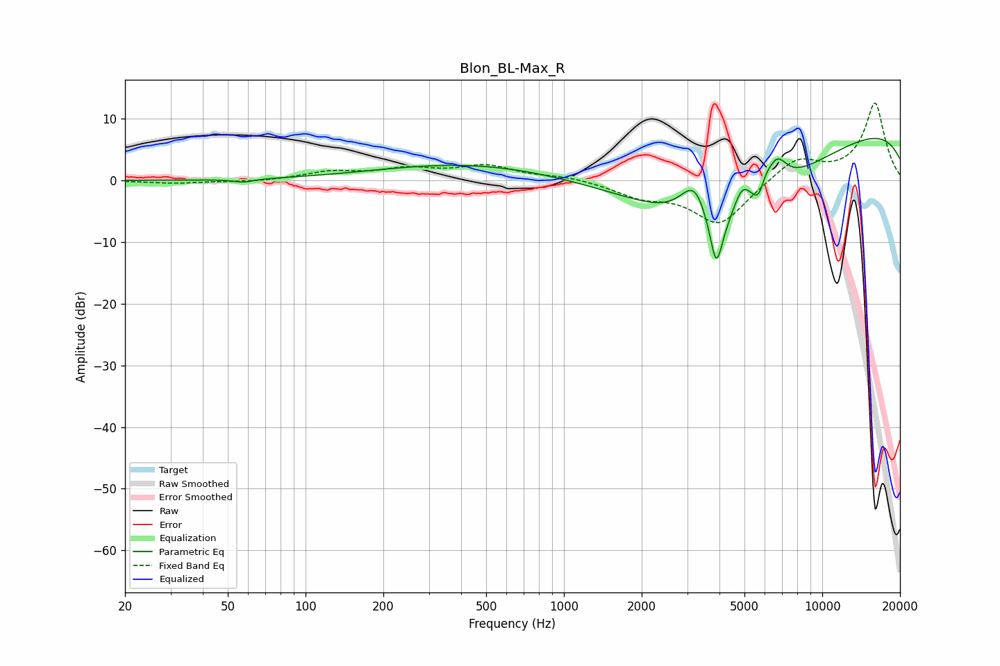

# Blon_BL-Max_R
See [usage instructions](https://github.com/jaakkopasanen/AutoEq#usage) for more options and info.

### Parametric EQs
Apply preamp of -6.9 dB when using parametric equalizer.

|   # | Type    |   Fc (Hz) |    Q |   Gain (dB) |
|-----|---------|-----------|------|-------------|
|   1 | Peaking |        58 | 3.59 |        -0.5 |
|   2 | Peaking |       663 | 0.29 |         3.8 |
|   3 | Peaking |      3212 | 2.32 |         8.3 |
|   4 | Peaking |      3889 | 5.8  |        -8.3 |
|   5 | Peaking |      3891 | 0.49 |       -19.4 |
|   6 | Peaking |      4895 | 3.71 |         5   |
|   7 | Peaking |      5678 | 5.97 |        -2.3 |
|   8 | Peaking |      6032 | 5.93 |         1.6 |
|   9 | Peaking |      6676 | 3.34 |         4.9 |
|  10 | Peaking |     10000 | 0.18 |        10.6 |

### Fixed Band EQs
When using fixed band (also called graphic) equalizer, apply preamp of **-12.6 dB** (if available) and set gains manually with these parameters.

|   # | Type    |   Fc (Hz) |    Q |   Gain (dB) |
|-----|---------|-----------|------|-------------|
|   1 | Peaking |        31 | 1.41 |        -0.4 |
|   2 | Peaking |        62 | 1.41 |        -0.2 |
|   3 | Peaking |       125 | 1.41 |         1.3 |
|   4 | Peaking |       250 | 1.41 |         1.6 |
|   5 | Peaking |       500 | 1.41 |         2.2 |
|   6 | Peaking |      1000 | 1.41 |         0.7 |
|   7 | Peaking |      2000 | 1.41 |        -2.2 |
|   8 | Peaking |      4000 | 1.41 |        -7.2 |
|   9 | Peaking |      8000 | 1.41 |         3.7 |
|  10 | Peaking |     16000 | 1.41 |        12.5 |

### Graphs

