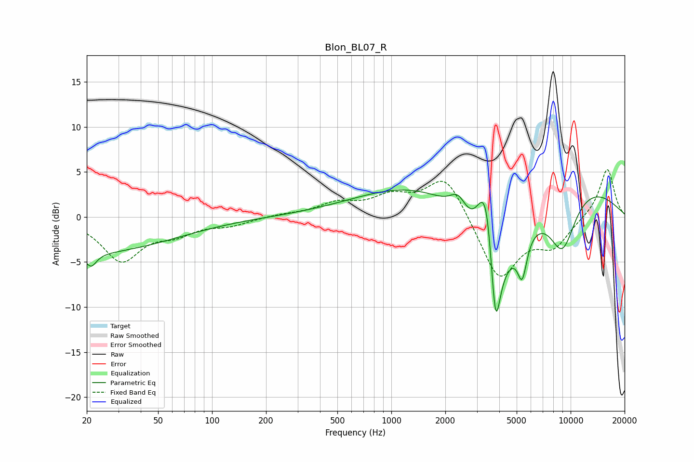

# Blon_BL07_R
See [usage instructions](https://github.com/jaakkopasanen/AutoEq#usage) for more options and info.

### Parametric EQs
Apply preamp of -3.1 dB when using parametric equalizer.

|   # | Type    |   Fc (Hz) |    Q |   Gain (dB) |
|-----|---------|-----------|------|-------------|
|   1 | Peaking |        20 | 0.29 |        -4   |
|   2 | Peaking |        21 | 4.68 |        -1.5 |
|   3 | Peaking |      2357 | 3.07 |         2.2 |
|   4 | Peaking |      3233 | 3.07 |         5.7 |
|   5 | Peaking |      3433 | 4.92 |         3.9 |
|   6 | Peaking |      3736 | 0.93 |       -13.3 |
|   7 | Peaking |      3815 | 5.86 |        -7.7 |
|   8 | Peaking |      4206 | 0.18 |         6.7 |
|   9 | Peaking |      5369 | 5.29 |        -4.3 |
|  10 | Peaking |      8993 | 1.63 |        -6.6 |

### Fixed Band EQs
When using fixed band (also called graphic) equalizer, apply preamp of **-5.4 dB** (if available) and set gains manually with these parameters.

|   # | Type    |   Fc (Hz) |    Q |   Gain (dB) |
|-----|---------|-----------|------|-------------|
|   1 | Peaking |        31 | 1.41 |        -4.7 |
|   2 | Peaking |        62 | 1.41 |        -1.5 |
|   3 | Peaking |       125 | 1.41 |        -0.8 |
|   4 | Peaking |       250 | 1.41 |         0.2 |
|   5 | Peaking |       500 | 1.41 |         1.4 |
|   6 | Peaking |      1000 | 1.41 |         2   |
|   7 | Peaking |      2000 | 1.41 |         4.8 |
|   8 | Peaking |      4000 | 1.41 |        -7.1 |
|   9 | Peaking |      8000 | 1.41 |        -2.9 |
|  10 | Peaking |     16000 | 1.41 |         5.5 |

### Graphs

