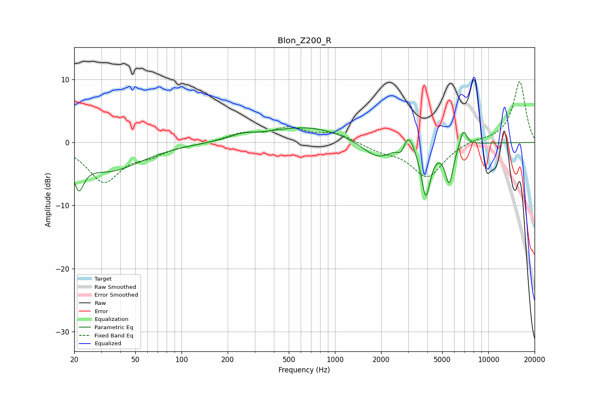

# Blon_Z200_R
See [usage instructions](https://github.com/jaakkopasanen/AutoEq#usage) for more options and info.

### Parametric EQs
Apply preamp of -2.4 dB when using parametric equalizer.

|   # | Type    |   Fc (Hz) |    Q |   Gain (dB) |
|-----|---------|-----------|------|-------------|
|   1 | Peaking |        21 | 4.26 |        -4.5 |
|   2 | Peaking |        34 | 0.67 |        -4.4 |
|   3 | Peaking |       250 | 1.76 |         0.7 |
|   4 | Peaking |       653 | 0.55 |         2.5 |
|   5 | Peaking |      1901 | 1.41 |        -2.9 |
|   6 | Peaking |      2713 | 5.99 |        -1.5 |
|   7 | Peaking |      2999 | 3.83 |         3   |
|   8 | Peaking |      3909 | 4.57 |        -8.3 |
|   9 | Peaking |      5555 | 5.14 |        -6   |
|  10 | Peaking |      6870 | 5.94 |         2.7 |

### Fixed Band EQs
When using fixed band (also called graphic) equalizer, apply preamp of **-9.7 dB** (if available) and set gains manually with these parameters.

|   # | Type    |   Fc (Hz) |    Q |   Gain (dB) |
|-----|---------|-----------|------|-------------|
|   1 | Peaking |        31 | 1.41 |        -6.1 |
|   2 | Peaking |        62 | 1.41 |        -1.5 |
|   3 | Peaking |       125 | 1.41 |        -0.2 |
|   4 | Peaking |       250 | 1.41 |         1.3 |
|   5 | Peaking |       500 | 1.41 |         2.1 |
|   6 | Peaking |      1000 | 1.41 |         1.4 |
|   7 | Peaking |      2000 | 1.41 |        -1.1 |
|   8 | Peaking |      4000 | 1.41 |        -5.5 |
|   9 | Peaking |      8000 | 1.41 |         0.5 |
|  10 | Peaking |     16000 | 1.41 |         9.7 |

### Graphs

