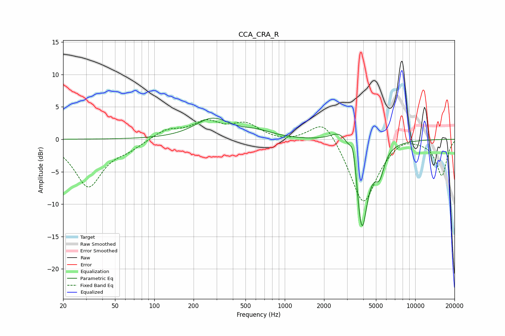

# CCA_CRA_R
See [usage instructions](https://github.com/jaakkopasanen/AutoEq#usage) for more options and info.

### Parametric EQs
Apply preamp of -3.4 dB when using parametric equalizer.

|   # | Type    |   Fc (Hz) |    Q |   Gain (dB) |
|-----|---------|-----------|------|-------------|
|   1 | Peaking |       278 | 1.07 |         3.1 |
|   2 | Peaking |       348 | 4.66 |         0   |
|   3 | Peaking |       610 | 1.16 |         1   |
|   4 | Peaking |      1470 | 1.65 |        -0   |
|   5 | Peaking |      2686 | 1.96 |         2.3 |
|   6 | Peaking |      3351 | 5.85 |         3.4 |
|   7 | Peaking |      3772 | 6    |        -3   |
|   8 | Peaking |      3978 | 3.14 |       -13.1 |
|   9 | Peaking |      4069 | 4.79 |         1.2 |
|  10 | Peaking |      5331 | 3.91 |        -3.6 |

### Fixed Band EQs
When using fixed band (also called graphic) equalizer, apply preamp of **-3.1 dB** (if available) and set gains manually with these parameters.

|   # | Type    |   Fc (Hz) |    Q |   Gain (dB) |
|-----|---------|-----------|------|-------------|
|   1 | Peaking |        31 | 1.41 |        -7.2 |
|   2 | Peaking |        62 | 1.41 |        -1.1 |
|   3 | Peaking |       125 | 1.41 |         1.5 |
|   4 | Peaking |       250 | 1.41 |         2.5 |
|   5 | Peaking |       500 | 1.41 |         2.2 |
|   6 | Peaking |      1000 | 1.41 |        -0.4 |
|   7 | Peaking |      2000 | 1.41 |         3.7 |
|   8 | Peaking |      4000 | 1.41 |       -10.2 |
|   9 | Peaking |      8000 | 1.41 |         1   |
|  10 | Peaking |     16000 | 1.41 |        -5.5 |

### Graphs

