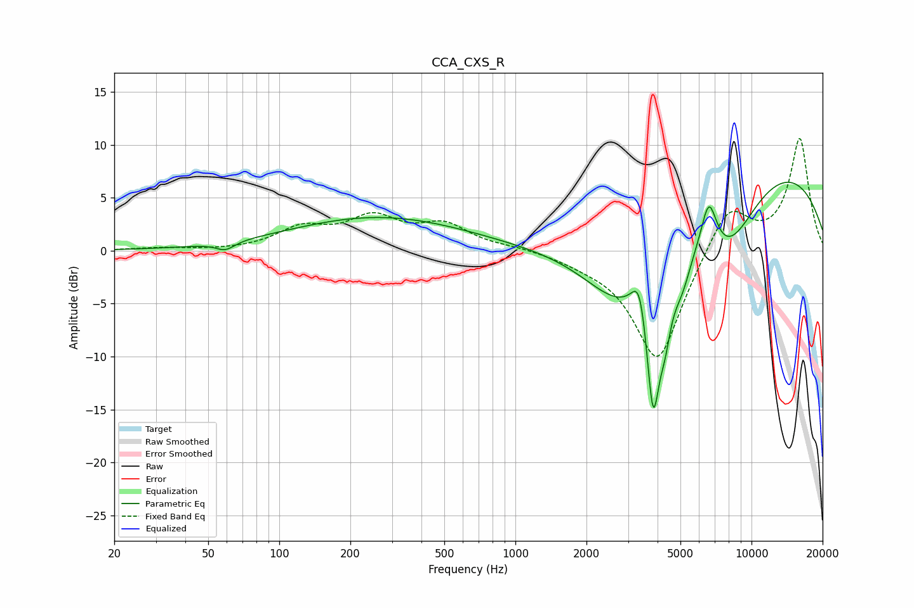

# CCA_CXS_R
See [usage instructions](https://github.com/jaakkopasanen/AutoEq#usage) for more options and info.

### Parametric EQs
Apply preamp of -6.6 dB when using parametric equalizer.

|   # | Type    |   Fc (Hz) |    Q |   Gain (dB) |
|-----|---------|-----------|------|-------------|
|   1 | Peaking |        59 | 3.62 |        -0.8 |
|   2 | Peaking |       265 | 0.38 |         3.2 |
|   3 | Peaking |      2754 | 0.83 |        -6.9 |
|   4 | Peaking |      3360 | 4.43 |         4.2 |
|   5 | Peaking |      3834 | 4.19 |       -14.3 |
|   6 | Peaking |      4315 | 5.87 |        -3   |
|   7 | Peaking |      5061 | 3.2  |        -3.1 |
|   8 | Peaking |      6601 | 4.11 |         4.6 |
|   9 | Peaking |      7901 | 0.97 |        -6.8 |
|  10 | Peaking |     10000 | 0.25 |         9   |

### Fixed Band EQs
When using fixed band (also called graphic) equalizer, apply preamp of **-10.7 dB** (if available) and set gains manually with these parameters.

|   # | Type    |   Fc (Hz) |    Q |   Gain (dB) |
|-----|---------|-----------|------|-------------|
|   1 | Peaking |        31 | 1.41 |         0.2 |
|   2 | Peaking |        62 | 1.41 |        -0   |
|   3 | Peaking |       125 | 1.41 |         1.9 |
|   4 | Peaking |       250 | 1.41 |         2.8 |
|   5 | Peaking |       500 | 1.41 |         2.2 |
|   6 | Peaking |      1000 | 1.41 |         0.3 |
|   7 | Peaking |      2000 | 1.41 |        -0.6 |
|   8 | Peaking |      4000 | 1.41 |       -10.7 |
|   9 | Peaking |      8000 | 1.41 |         4.7 |
|  10 | Peaking |     16000 | 1.41 |        10.6 |

### Graphs

