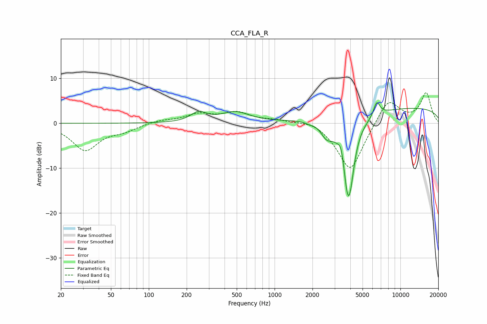

# CCA_FLA_R
See [usage instructions](https://github.com/jaakkopasanen/AutoEq#usage) for more options and info.

### Parametric EQs
Apply preamp of -4.7 dB when using parametric equalizer.

|   # | Type    |   Fc (Hz) |    Q |   Gain (dB) |
|-----|---------|-----------|------|-------------|
|   1 | Peaking |       249 | 2.28 |         2.1 |
|   2 | Peaking |       487 | 1.26 |         2.3 |
|   3 | Peaking |      1872 | 4.83 |        -0.3 |
|   4 | Peaking |      2585 | 3.21 |        -2.6 |
|   5 | Peaking |      3383 | 5.93 |         3.2 |
|   6 | Peaking |      3811 | 2.86 |       -17   |
|   7 | Peaking |      4019 | 5.76 |        -3.6 |
|   8 | Peaking |      4903 | 4.18 |         0.3 |
|   9 | Peaking |      6489 | 5.4  |         3.1 |
|  10 | Peaking |     10000 | 0.18 |         3.6 |

### Fixed Band EQs
When using fixed band (also called graphic) equalizer, apply preamp of **-6.9 dB** (if available) and set gains manually with these parameters.

|   # | Type    |   Fc (Hz) |    Q |   Gain (dB) |
|-----|---------|-----------|------|-------------|
|   1 | Peaking |        31 | 1.41 |        -5.9 |
|   2 | Peaking |        62 | 1.41 |        -1.4 |
|   3 | Peaking |       125 | 1.41 |         0.7 |
|   4 | Peaking |       250 | 1.41 |         1.9 |
|   5 | Peaking |       500 | 1.41 |         2.2 |
|   6 | Peaking |      1000 | 1.41 |         0.7 |
|   7 | Peaking |      2000 | 1.41 |         1.1 |
|   8 | Peaking |      4000 | 1.41 |       -11   |
|   9 | Peaking |      8000 | 1.41 |         5.9 |
|  10 | Peaking |     16000 | 1.41 |         6.7 |

### Graphs

