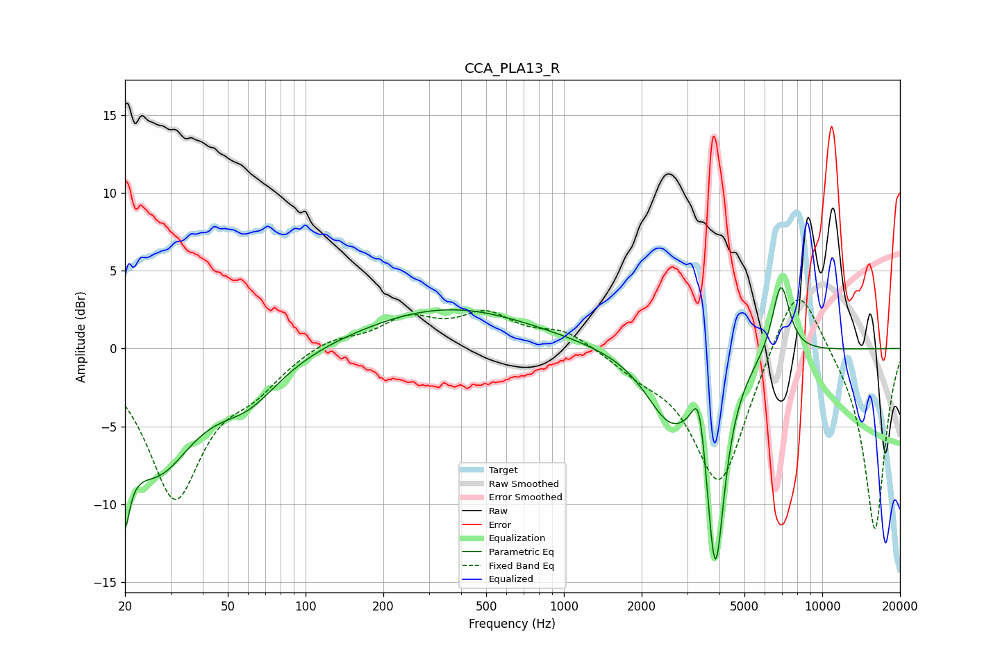

# CCA_PLA13_R
See [usage instructions](https://github.com/jaakkopasanen/AutoEq#usage) for more options and info.

### Parametric EQs
Apply preamp of -4.0 dB when using parametric equalizer.

|   # | Type    |   Fc (Hz) |    Q |   Gain (dB) |
|-----|---------|-----------|------|-------------|
|   1 | Peaking |        20 | 5.48 |        -8.9 |
|   2 | Peaking |        20 | 5.93 |         3.2 |
|   3 | Peaking |        26 | 0.96 |        -7.2 |
|   4 | Peaking |        60 | 1.13 |        -2.4 |
|   5 | Peaking |       356 | 0.43 |         2.6 |
|   6 | Peaking |      2576 | 1.47 |        -4.1 |
|   7 | Peaking |      3338 | 5.24 |         3.6 |
|   8 | Peaking |      3754 | 6    |        -1   |
|   9 | Peaking |      3868 | 3.81 |       -12.4 |
|  10 | Peaking |      6920 | 4.03 |         4.7 |

### Fixed Band EQs
When using fixed band (also called graphic) equalizer, apply preamp of **-3.2 dB** (if available) and set gains manually with these parameters.

|   # | Type    |   Fc (Hz) |    Q |   Gain (dB) |
|-----|---------|-----------|------|-------------|
|   1 | Peaking |        31 | 1.41 |        -9.4 |
|   2 | Peaking |        62 | 1.41 |        -1.9 |
|   3 | Peaking |       125 | 1.41 |         0.8 |
|   4 | Peaking |       250 | 1.41 |         1.8 |
|   5 | Peaking |       500 | 1.41 |         2   |
|   6 | Peaking |      1000 | 1.41 |         1.1 |
|   7 | Peaking |      2000 | 1.41 |        -1.1 |
|   8 | Peaking |      4000 | 1.41 |        -8.9 |
|   9 | Peaking |      8000 | 1.41 |         5.3 |
|  10 | Peaking |     16000 | 1.41 |       -11.8 |

### Graphs

