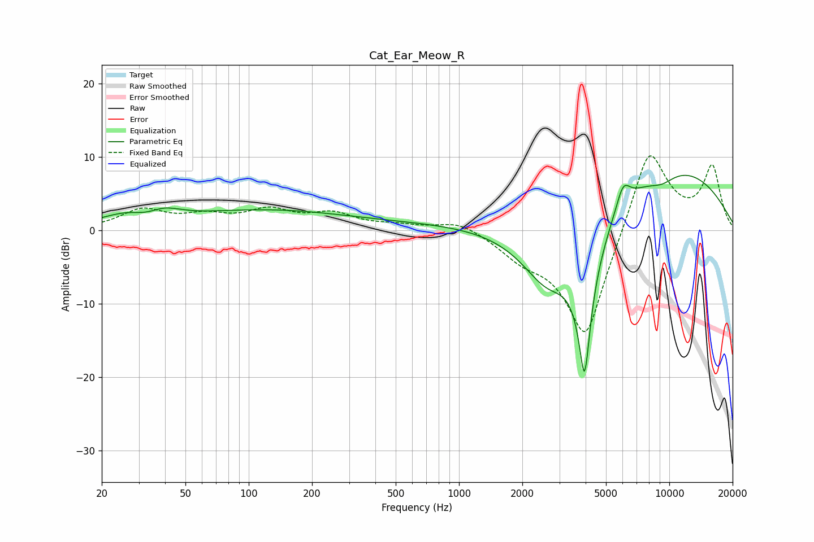

# Cat_Ear_Meow_R
See [usage instructions](https://github.com/jaakkopasanen/AutoEq#usage) for more options and info.

### Parametric EQs
Apply preamp of -7.6 dB when using parametric equalizer.

|   # | Type    |   Fc (Hz) |    Q |   Gain (dB) |
|-----|---------|-----------|------|-------------|
|   1 | Peaking |        28 | 1.02 |         2.1 |
|   2 | Peaking |        33 | 1.77 |        -1.2 |
|   3 | Peaking |        39 | 1.87 |         1.2 |
|   4 | Peaking |       105 | 0.39 |         2.1 |
|   5 | Peaking |       437 | 0.24 |         1   |
|   6 | Peaking |      2634 | 1.07 |        -8.1 |
|   7 | Peaking |      3953 | 3.61 |       -20   |
|   8 | Peaking |      6027 | 4.13 |         3.3 |
|   9 | Peaking |      9208 | 1.9  |        -1.4 |
|  10 | Peaking |     10000 | 0.35 |         8.7 |

### Fixed Band EQs
When using fixed band (also called graphic) equalizer, apply preamp of **-10.3 dB** (if available) and set gains manually with these parameters.

|   # | Type    |   Fc (Hz) |    Q |   Gain (dB) |
|-----|---------|-----------|------|-------------|
|   1 | Peaking |        31 | 1.41 |         2.6 |
|   2 | Peaking |        62 | 1.41 |         1.6 |
|   3 | Peaking |       125 | 1.41 |         2.4 |
|   4 | Peaking |       250 | 1.41 |         2   |
|   5 | Peaking |       500 | 1.41 |         0.6 |
|   6 | Peaking |      1000 | 1.41 |         1.5 |
|   7 | Peaking |      2000 | 1.41 |        -2.4 |
|   8 | Peaking |      4000 | 1.41 |       -15.7 |
|   9 | Peaking |      8000 | 1.41 |        12.6 |
|  10 | Peaking |     16000 | 1.41 |         8.4 |

### Graphs

