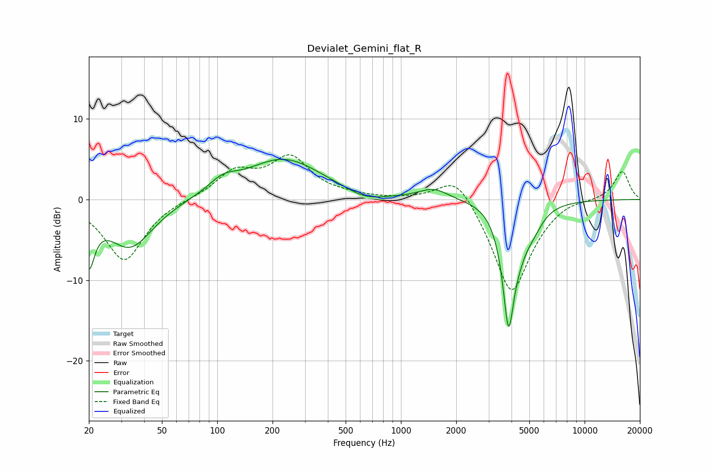

# Devialet_Gemini_flat_R
See [usage instructions](https://github.com/jaakkopasanen/AutoEq#usage) for more options and info.

### Parametric EQs
Apply preamp of -5.1 dB when using parametric equalizer.

|   # | Type    |   Fc (Hz) |    Q |   Gain (dB) |
|-----|---------|-----------|------|-------------|
|   1 | Peaking |        20 | 4.71 |        -6.3 |
|   2 | Peaking |        34 | 1.13 |        -6   |
|   3 | Peaking |       107 | 1.9  |         1.5 |
|   4 | Peaking |       229 | 0.67 |         5   |
|   5 | Peaking |       637 | 1.42 |        -1   |
|   6 | Peaking |      1504 | 1.78 |         1.3 |
|   7 | Peaking |      3706 | 1.38 |         1.3 |
|   8 | Peaking |      3853 | 3.84 |       -15.3 |
|   9 | Peaking |      4442 | 2.69 |        -2.4 |
|  10 | Peaking |      5277 | 2.53 |        -1.8 |

### Fixed Band EQs
When using fixed band (also called graphic) equalizer, apply preamp of **-5.6 dB** (if available) and set gains manually with these parameters.

|   # | Type    |   Fc (Hz) |    Q |   Gain (dB) |
|-----|---------|-----------|------|-------------|
|   1 | Peaking |        31 | 1.41 |        -7.6 |
|   2 | Peaking |        62 | 1.41 |         0.1 |
|   3 | Peaking |       125 | 1.41 |         3.2 |
|   4 | Peaking |       250 | 1.41 |         4.9 |
|   5 | Peaking |       500 | 1.41 |         0.3 |
|   6 | Peaking |      1000 | 1.41 |         0   |
|   7 | Peaking |      2000 | 1.41 |         3.8 |
|   8 | Peaking |      4000 | 1.41 |       -12   |
|   9 | Peaking |      8000 | 1.41 |         0.6 |
|  10 | Peaking |     16000 | 1.41 |         3.6 |

### Graphs

