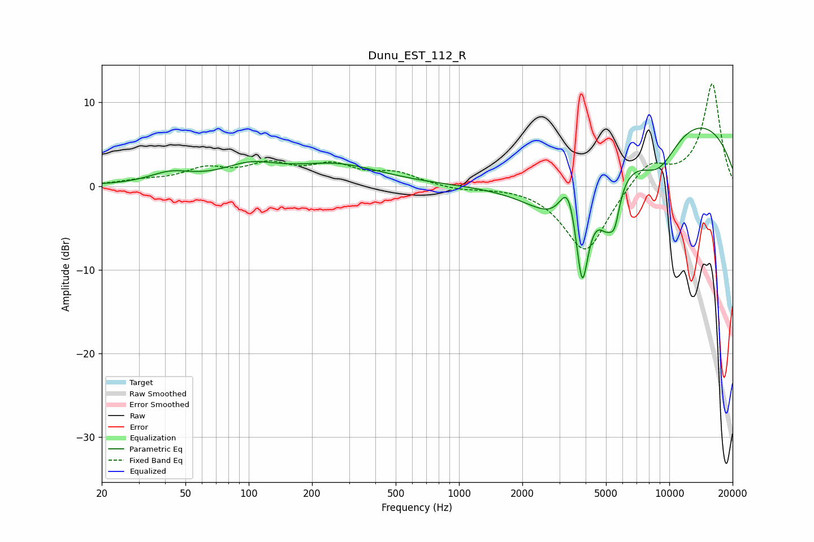

# Dunu_EST_112_R
See [usage instructions](https://github.com/jaakkopasanen/AutoEq#usage) for more options and info.

### Parametric EQs
Apply preamp of -7.0 dB when using parametric equalizer.

|   # | Type    |   Fc (Hz) |    Q |   Gain (dB) |
|-----|---------|-----------|------|-------------|
|   1 | Peaking |        43 | 1.42 |         1.3 |
|   2 | Peaking |       102 | 1.06 |         2   |
|   3 | Peaking |       264 | 0.66 |         2.4 |
|   4 | Peaking |      3222 | 0.79 |        -8.2 |
|   5 | Peaking |      3305 | 3.41 |         5.3 |
|   6 | Peaking |      3853 | 4.76 |       -10.4 |
|   7 | Peaking |      5038 | 3.31 |        -4.3 |
|   8 | Peaking |      5506 | 5.79 |        -3.3 |
|   9 | Peaking |      8858 | 1.24 |        -5.2 |
|  10 | Peaking |     10000 | 0.25 |         9.3 |

### Fixed Band EQs
When using fixed band (also called graphic) equalizer, apply preamp of **-12.3 dB** (if available) and set gains manually with these parameters.

|   # | Type    |   Fc (Hz) |    Q |   Gain (dB) |
|-----|---------|-----------|------|-------------|
|   1 | Peaking |        31 | 1.41 |         0.5 |
|   2 | Peaking |        62 | 1.41 |         1.8 |
|   3 | Peaking |       125 | 1.41 |         2.2 |
|   4 | Peaking |       250 | 1.41 |         2.2 |
|   5 | Peaking |       500 | 1.41 |         1.4 |
|   6 | Peaking |      1000 | 1.41 |        -0.4 |
|   7 | Peaking |      2000 | 1.41 |         0.1 |
|   8 | Peaking |      4000 | 1.41 |        -8.1 |
|   9 | Peaking |      8000 | 1.41 |         3   |
|  10 | Peaking |     16000 | 1.41 |        12.2 |

### Graphs

