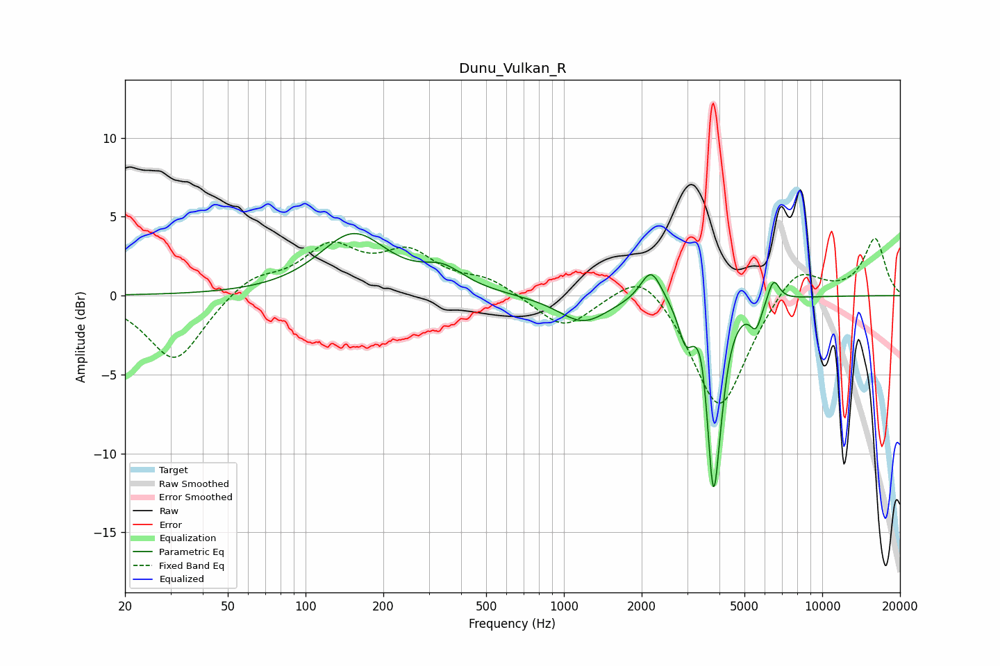

# Dunu_Vulkan_R
See [usage instructions](https://github.com/jaakkopasanen/AutoEq#usage) for more options and info.

### Parametric EQs
Apply preamp of -4.0 dB when using parametric equalizer.

|   # | Type    |   Fc (Hz) |    Q |   Gain (dB) |
|-----|---------|-----------|------|-------------|
|   1 | Peaking |       153 | 1.08 |         3.8 |
|   2 | Peaking |       340 | 1.71 |         1.3 |
|   3 | Peaking |      1186 | 1.48 |        -1.7 |
|   4 | Peaking |      2177 | 3.43 |         2.2 |
|   5 | Peaking |      2956 | 5.31 |        -2.1 |
|   6 | Peaking |      3430 | 6    |         1.4 |
|   7 | Peaking |      3790 | 5.42 |       -11.9 |
|   8 | Peaking |      4050 | 6    |        -1.2 |
|   9 | Peaking |      5544 | 6    |        -1.6 |
|  10 | Peaking |      6477 | 5.97 |         1.5 |

### Fixed Band EQs
When using fixed band (also called graphic) equalizer, apply preamp of **-3.7 dB** (if available) and set gains manually with these parameters.

|   # | Type    |   Fc (Hz) |    Q |   Gain (dB) |
|-----|---------|-----------|------|-------------|
|   1 | Peaking |        31 | 1.41 |        -4.2 |
|   2 | Peaking |        62 | 1.41 |         1.2 |
|   3 | Peaking |       125 | 1.41 |         2.9 |
|   4 | Peaking |       250 | 1.41 |         2.4 |
|   5 | Peaking |       500 | 1.41 |         1   |
|   6 | Peaking |      1000 | 1.41 |        -2.1 |
|   7 | Peaking |      2000 | 1.41 |         2.1 |
|   8 | Peaking |      4000 | 1.41 |        -7.5 |
|   9 | Peaking |      8000 | 1.41 |         2.1 |
|  10 | Peaking |     16000 | 1.41 |         3.6 |

### Graphs

