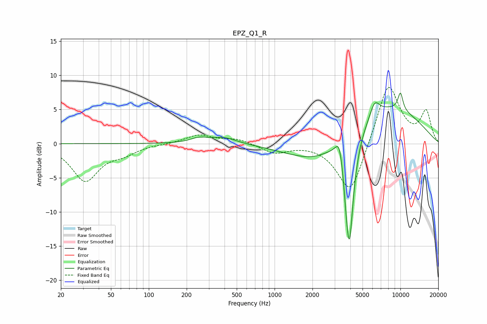

# EPZ_Q1_R
See [usage instructions](https://github.com/jaakkopasanen/AutoEq#usage) for more options and info.

### Parametric EQs
Apply preamp of -7.5 dB when using parametric equalizer.

|   # | Type    |   Fc (Hz) |    Q |   Gain (dB) |
|-----|---------|-----------|------|-------------|
|   1 | Peaking |       252 | 2.03 |         0.7 |
|   2 | Peaking |       397 | 1.42 |         0.9 |
|   3 | Peaking |      1296 | 0.77 |        -0.9 |
|   4 | Peaking |      2130 | 0.91 |        -2.5 |
|   5 | Peaking |      3281 | 4.57 |         3.5 |
|   6 | Peaking |      3753 | 6    |        -2.7 |
|   7 | Peaking |      3938 | 3.88 |       -16   |
|   8 | Peaking |      6244 | 3.68 |         2.2 |
|   9 | Peaking |      7510 | 0.39 |         5.6 |
|  10 | Peaking |     10000 | 5.99 |         2.6 |

### Fixed Band EQs
When using fixed band (also called graphic) equalizer, apply preamp of **-8.3 dB** (if available) and set gains manually with these parameters.

|   # | Type    |   Fc (Hz) |    Q |   Gain (dB) |
|-----|---------|-----------|------|-------------|
|   1 | Peaking |        31 | 1.41 |        -5.4 |
|   2 | Peaking |        62 | 1.41 |        -1.2 |
|   3 | Peaking |       125 | 1.41 |        -0   |
|   4 | Peaking |       250 | 1.41 |         1.3 |
|   5 | Peaking |       500 | 1.41 |         0.7 |
|   6 | Peaking |      1000 | 1.41 |        -1.4 |
|   7 | Peaking |      2000 | 1.41 |         0.1 |
|   8 | Peaking |      4000 | 1.41 |        -7.8 |
|   9 | Peaking |      8000 | 1.41 |         9.2 |
|  10 | Peaking |     16000 | 1.41 |         4.6 |

### Graphs

